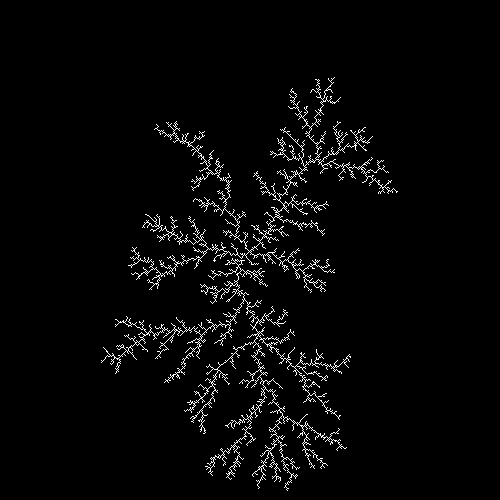
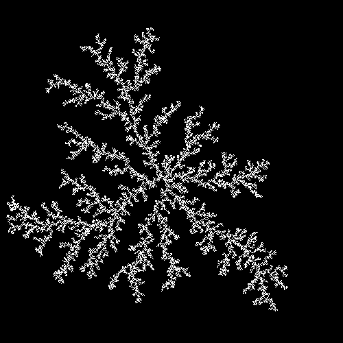
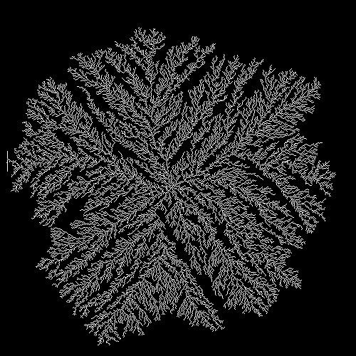

<style>
section::after {
  content: attr(data-marpit-pagination) ' / ' attr(data-marpit-pagination-total);
}
img[alt="center"] {
     display: block;
     margin: 0 auto;
}
h1 {
    font-size: 60px;
    text-align: center;
}
h2 {
    font-size: 30px;
    text-align: left;
    position: relative;
    left: -2em;
    line-height: 0px;
    top: 6em;
}
h3 {
    font-size: 40px;
    text-align: left;
    position: relative;
    left: -0.5em;
    bottom: 0.2em;
}
h4 {
    font-size: 25px;
    text-align: center;
    position: relative;
    left: -0.5em;
    bottom: 0.2em;
}
</style>

# Программная реализация агрегации ограниченной диффузией
## Ramzi Al-Dorikhim, Vasily O. Khuditsky, Nikita A. Toponen, Arsenij A. Ilinsky
## RUDN University, 3 March 2022 Moscow, Russia

--- 

# Агрегация, ограниченная диффузией

---

### 1. Сетка:

```java
// размерность окна
int N = 500;

// размерность поля
int launch = N - 10;

// создаем массив частиц
boolean[][] dla = new boolean[N][N];   
```

### 2. Затравочная частица:

```java
// создаем затравочную частицу
dla[240][240] = true;
```

---

### 3. Выпускаем случайную частицу:

```java
// будем выполнять цикл до тех пор, пока агрегация не достигнет границ
boolean done = false;
while (!done) {
    // случайная точка запуска частицы
    double m = Math.random();
    int x;
    int y;

    // нижняя граница экрана
    if (m < 0.25) {
        x = (int) (N * Math.random());
        y = launch;
    }
    // верхняя граница экрана
    else if (m < 0.50) {
        x = (int) (N * Math.random());
        y = 10;
    }
    // левая граница экрана
    else if (m < 0.75) {
        x = 10;
        y = (int) (N*Math.random());
    }
    // правая граница экрана
    else {
        x = launch;
        y = (int) (N*Math.random());
    }
    ...
```

---

### 4. Задаем направление движение частицы:

```java
    ...
    while (x < N - 2 && x > 1 && y < N - 2 && y > 1) {
        // задаем направление движения частицы
        double r = Math.random();
        if      (r < 0.25) x--;
        else if (r < 0.50) x++;
        else if (r < 0.75) y++;
        else               y--;
        ...
```

---

### 5. Проверяем принадлежности частицы к кластеру:

```java
        ...
        // проверяем, занят ли соседний участок
        if (dla[x-1][y]   || dla[x+1][y]   || dla[x][y-1]   || dla[x][y+1]   ||
                dla[x-1][y-1] || dla[x+1][y+1] || dla[x-1][y+1] || dla[x+1][y-1] ) {
            dla[x][y] = true;
            pic.set(x, N-y-1, Color.white);
            pic.show();

            // если агрегация достигает границы, то завершаем цикл
            if (y > launch) done = true;
            else if (y < 10) done = true;
            else if (x > launch) done = true;
            else if (x < 10) done = true;

            // выход из внутреннего цикла
            break;
        }
    }
}
```

---

### Полученный фрактал:



#### Рис.1 Агрегация, ограниченная диффузией

---

# Химически — ограниченная агрегация

---

### Уменьшаем вероятность прилепания частицы к кластеру

```java
    ...
        // проверяем, занят ли соседний участок
        if (dla[x-1][y]   || dla[x+1][y]   || dla[x][y-1]   || dla[x][y+1]   ||
                dla[x-1][y-1] || dla[x+1][y+1] || dla[x-1][y+1] || dla[x+1][y-1] ) {

            // вероятность приклеивания частицы
            double n = Math.random();
            
            // если вероятность меньше 0.3, то приклеиваем частицу к кластеру
            if (n<0.3) {
                dla[x][y] = true;
            }

            pic.set(x, N-y-1, Color.white);
            pic.show();

            // если агрегация достигает границы, то завершаем цикл
            if (y > launch) done = true;
            else if (y < 10) done = true;
            else if (x > launch) done = true;
            else if (x < 10) done = true;

            // выход из внутреннего цикла
            break;
        }
    }
}
```

---

### Полученный фрактал:



#### Рис.2 Химически — ограниченная агрегация

---

# Баллистическая агрегация 

---

### Изменяем движение частицы на прямолинейное:

```java
    ...
    // задаем баллистическое направление движения частицы
    double r = Math.random();
    while (x < N - 2 && x > 1 && y < N - 2 && y > 1) {
        if      (r < 0.25) x--;
        else if (r < 0.50) x++;
        else if (r < 0.75) y++;
        else y--;
        ...
```

---

### Полученный фрактал:



#### Рис.3 Баллистическая агрегация

---

# Кластер-кластерная агрегация

---

### Хранение кластеров

```java
public static ArrayList<Particle> cluster; //коллекция частиц = кластер
public static Map<Integer, ArrayList<Particle>> clusters = new HashMap<Integer, ArrayList<Particle>>();  //словарь с кластерами
```

---

### Заполнение поля частицами

```java
int P = 15000; // число частиц
        // разбрасываем частицы по полю
        for (int i = 0; i<P; i++) {
            int xp = (int) (Math.random()*490);
            int yp = (int) (Math.random()*490);
            cluster = new ArrayList<>();
            Particle p = new Particle(xp,yp);
            cluster.add(p);
            if (!isOccupied(xp,yp)) {
                dla[xp][yp]=true;
                clusters.put(i,cluster);
            }
        }
```

---

### Движение кластеров

```java
boolean done = false;
Iterator<Map.Entry<Integer, ArrayList<Particle>>> iterator;
        while (!done) {
            iterator = clusters.entrySet().iterator();
            while (iterator.hasNext()) {
                Map.Entry<Integer, ArrayList<Particle>> entry = iterator.next();
                double r = Math.random();
                int move;
                if (r < 0.25) move = 1;
                else if (r < 0.50) move = 2;
                else if (r < 0.75) move = 3;
                else move = 4;
                moveCluster(move, entry.getValue(), pic);
                for (Particle p : entry.getValue()) {
                    if (isOccupied(p.x-1,p.y)) {
                        Particle pc = new Particle(p.x - 1, p.y);
                        if (entry.getValue().contains(pc)) {
                            break;
                        } else {
                            mergeClusters(p,pc);
                        }
                    }
                    ...
            if (entry.getValue().size()==P) {
                    done = true;
                }
            }
        }

```

---

### Вспомогательный метод движения кластера

```java
public static void moveCluster
    (int move, ArrayList<Particle> cluster, Picture pic){
        for (Particle p: cluster) {
            int x_before = p.x;
            int y_before = p.y;
            p.moveParticle(move);
            dla[x_before][y_before]=false;
            dla[p.x][p.y]=true;
            pic.set(p.x, N-p.y-1, Color.white);
            pic.set(x_before,N-y_before-1, Color.black);
            pic.show();
        }
    }
```

---

### Вспомогательный метод слияния кластеров

```java
public static void mergeClusters(Particle p1, Particle p2) {
        ArrayList<Particle> list1 = new ArrayList<>();
        ArrayList<Particle> list2 = new ArrayList<>();
        Integer numOfCluster1 = 0;
        Integer numOfCluster2 = 0;
        for (Map.Entry<Integer, ArrayList<Particle>> entry : clusters.entrySet()) {
            if (entry.getValue().contains(p1)) {
                list1.addAll(entry.getValue());
                numOfCluster1 = entry.getKey();
            }
            if (entry.getValue().contains(p2)) {
                list2.addAll(entry.getValue());
                numOfCluster2 = entry.getKey();
            }
        }
        if (!list1.isEmpty() && !list2.isEmpty()) {
            list1.addAll(list2);
            clusters.put(numOfCluster1, list1);
            list2.removeAll(list2);
            clusters.put(numOfCluster2, list2);
        }
    }
```

---

### Полученный фрактал:


#### Рис.4 Кластер-кластерная агрегация

---

### Код

- Все материалы, а также код программ можно найти здесь: [github](https://github.com/natoponen/2021_2022_Mathematical_Modeling/tree/master/Project/presentation_3)

---

### Библиография

1. Медведев Д. А., Куперштох А. Л., Прууэл Э. Р., Сатонкина Н. П., Карпов Д. И. : Моделирование физических процессов и явлений на ПК: Учеб. пособие / Новосибирск: Новосиб. гос. ун-т., 2010. — 101 с.
2. Электронный ресурс [Simulating 2D diffusion-limited aggregation (DLA) with JavaScript](https://medium.com/@jason.webb/) : https://medium.com/@jason.webb/simulating-dla-in-js-f1914eb04b1d
3. Международный научно-практический журнал "Программные продукты и системы": Тыртышников А.Ю., Лебедев И.В., Иванов С.И., Меньшутина Н.В. : [Сравнение алгоритмов DLA и RLA при моделировании пористых структур](http://swsys.ru/index.php?page=article&id=4380) Статья опубликована в выпуске журнала № 4 за 2017 год. [ на стр. 758-764 ] http://swsys.ru/index.php?page=article&id=4380

---

4. Электронный ресурс [Симуляция роста кристаллов: ограниченная диффузией агрегация на Javascript](https://habr.com/ru/post/507444/) : https://habr.com/ru/post/507444/

5. Электронная энциклопедия Wikipedia. Статья: [Diffusion-limited aggregation](https://en.wikipedia.org/wiki/Diffusion-limited_aggregation) : https://en.wikipedia.org/wiki/Diffusion-limited_aggregation

---

# Спасибо за внимание!