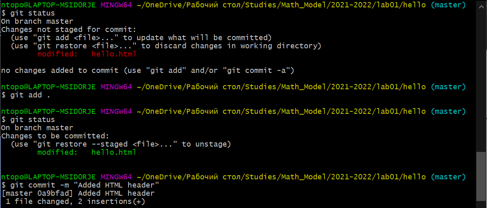
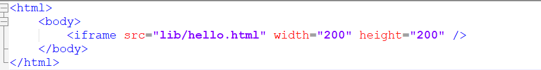
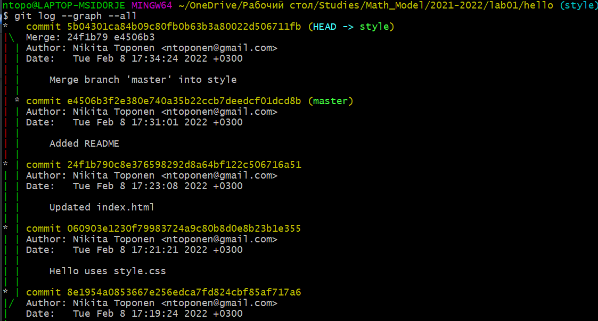
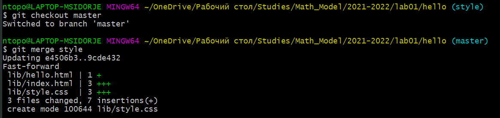
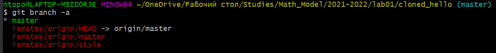

---
​---
# Front matter
title: "Отчет по лабораторной работе №1"
subtitle: "Работа с Git"
author: "Топонен Никита Андреевич"
# Generic otions
lang: ru-RU
toc-title: "Содержание"
# Bibliography
bibliography: bib/cite.bib
csl: pandoc/csl/gost-r-7-0-5-2008-numeric.csl
# Pdf output format
toc: true # Table of contents
toc_depth: 2
lof: true # List of figures
lot: true # List of tables
fontsize: 12pt
linestretch: 1.5
papersize: a4
documentclass: scrreprt
## I18n
polyglossia-lang:
  name: russian
  options:
	- spelling=modern
	- babelshorthands=true
polyglossia-otherlangs:
  name: english
### Fonts
mainfont: PT Serif
romanfont: PT Serif
sansfont: PT Sans
monofont: PT Mono
mainfontoptions: Ligatures=TeX
romanfontoptions: Ligatures=TeX
sansfontoptions: Ligatures=TeX,Scale=MatchLowercase
monofontoptions: Scale=MatchLowercase,Scale=0.9
## Biblatex
biblatex: true
biblio-style: "gost-numeric"
biblatexoptions:
  - parentracker=true
  - backend=biber
  - hyperref=auto
  - language=auto
  - autolang=other*
  - citestyle=gost-numeric
## Misc options
indent: true
header-includes:
  - \linepenalty=10 # the penalty added to the badness of each line within a paragraph (no associated penalty node) Increasing the value makes tex try to have fewer lines in the paragraph.
  - \interlinepenalty=0 # value of the penalty (node) added after each line of a paragraph.
  - \hyphenpenalty=50 # the penalty for line breaking at an automatically inserted hyphen
  - \exhyphenpenalty=50 # the penalty for line breaking at an explicit hyphen
  - \binoppenalty=700 # the penalty for breaking a line at a binary operator
  - \relpenalty=500 # the penalty for breaking a line at a relation
  - \clubpenalty=150 # extra penalty for breaking after first line of a paragraph
  - \widowpenalty=150 # extra penalty for breaking before last line of a paragraph
  - \displaywidowpenalty=50 # extra penalty for breaking before last line before a display math
  - \brokenpenalty=100 # extra penalty for page breaking after a hyphenated line
  - \predisplaypenalty=10000 # penalty for breaking before a display
  - \postdisplaypenalty=0 # penalty for breaking after a display
  - \floatingpenalty = 20000 # penalty for splitting an insertion (can only be split footnote in standard LaTeX)
  - \raggedbottom # or \flushbottom
  - \usepackage{float} # keep figures where there are in the text
  - \floatplacement{figure}{H} # keep figures where there are in the text
​---
---

# Цель работы

Вспомнить основные команды Git Bash для работы с системой контроля версий git. Выполнить тренировочные задания по работе с проектом(репозиторием) с помощью git.

# План работы

- ## Подготовка
- ## Создание проекта
- ## Внесение изменений
- ## Индексация изменений
- ## Отмена локальных изменений (до индексации)
- ##  Отмена проиндексированных изменений (перед коммитом)
- ## Отмена коммитов
- ## Удаление коммиттов из ветки
- ## Удаление тега oops
- ## Внесение изменений в коммиты
- ## Перемещение файлов
- ##  Второй способ перемещения файлов
- ## Подробнее о структуре
- ## Git внутри: Каталог .git
- ## Работа непосредственно с объектами git
- ## Создание ветки
- ## Навигация по веткам
- ## Изменения в ветке master
- ## Коммит изменений README.md в ветку master
- ## Слияние
- ## Создание конфликта
- ## Разрешение конфликтов
- ##  Сброс ветки style
- ## Сброс ветки master
- ## Перебазирование
- ## Слияние в ветку master
- ##  Клонирование репозиториев
- ## Просмотр клонированного репозитория
- ## Что такое origin?
- ## Удаленные ветки
- ##  Изменение оригинального репозитория
- ## Слияние извлеченных изменений
- ## Добавление ветки наблюдения
- ## Чистые репозитории
- ## Создание чистого репозитория
- ##  Добавление удаленного репозитория
- ##  Отправка изменений
- ##  Извлечение общих изменений


# Выполнение лабораторной работы

## Подготовка к работе с git

Для начала работы необходимо выполнить команды git config, чтобы git узнал ваше имя и электронную почту. Однако, так как я ранее уже использовал git, я сделал это раньше. Проверим это с помощью команды git config --list, которая выводит всю информацию о конфиге вашего git. В ней видно данные пользователя в последних двух строках. (рис. [-@fig:001])

{#fig:001 width=70%}

Также необходимо установить параметры окончаний строк. Настройка core.autocrlf с параметрами true и input делает все переводы строк текстовых файлов в главном репозитории одинаковыми. (рис. [-@fig:002])

{#fig:002 width=70%}

Так как по умолчанию, git будет печатать не-ASCII символов в именах файлов в виде восьмеричных последовательностей \nnn. Что бы избежать нечитаемых строк, установим соответствующий флаг. (рис. [-@fig:003])

{#fig:003 width=70%}

## Создание проекта

Создадим пустой каталог hello, затем войдем него и создадим файл с именем hello.html, содержащий приветствие "Hello world!".

Чтобы создать git репозиторий из этого каталога, выполним команду git init. (рис. [-@fig:004])

{#fig:004 width=70%}

Добавим файл в репозиторий. (рис. [-@fig:005])

{#fig:005 width=70%}

Используем команду git status, чтобы проверить текущее состояние репозитория. (рис. [-@fig:006])

{#fig:006 width=70%}

## Внесение изменений

Добавим кое-какие HTML-теги к нашему приветствию. Изменим содержимое файла hello.html на:
*<h1>Hello, World!</h1>*
И проверим состояние рабочего каталога. (рис. [-@fig:007])

{#fig:007 width=70%}

git знает, что файл hello.html был изменен, но при этом эти изменения еще
не зафиксированы в репозитории.

## Индексация изменений

Теперь выполним команду git, чтобы проиндексировать изменения. А затем проверим состояние репозитория. (рис. [-@fig:008] рис. [-@fig:009])

{#fig:008 width=70%}

{#fig:009 width=70%}

Изменения файла hello.html были проиндексированы. Это означает, что git теперь знает об изменении, но изменение пока не записано в репозиторий. Следующий коммит будет включать в себя проиндексированные изменения.

Сделаем коммит. (рис. [-@fig:010])

{#fig:010 width=70%}

Открылся редактор.

В первой строке введем комментарий: «Added h1 tag». Сохраним файл и выйдем из редактора.

Снова проверим состояние. (рис. [-@fig:011])

{#fig:011 width=70%}

Рабочий каталог чистый, можно продолжить работу.

Изменим страницу «Hello, World», чтобы она содержала стандартные теги  *<html>* и *<body>*.
```html
<html>
  <body>
    <h1>Hello, World!</h1>
  </body>
</html>
```
Теперь добавим это изменение в индекс git.

Теперь добавим заголовки HTML (секцию *<head>*) к странице «Hello, World».
```html
<html>
  <head>
  </head>
  <body>
    <h1>Hello, World!</h1>
  </body>
</html>
```
Проверим текущий статус

hello.html указан дважды в состоянии. Первое изменение (добавление стандартных тегов) проиндексировано и готово к коммиту. Второе изменение (добавление заголовков HTML) является непроиндексированным. Если бы мы делали коммит сейчас, заголовки не были бы сохранены в репозиторий.

Произведем коммит проиндексированного изменения (значение по умолчанию), а затем еще раз проверим состояние. (рис. [-@fig:012])

{#fig:012 width=70%}

Состояние команды говорит о том, что hello.html имеет незафиксированные изменения, но уже не в буферной зоне.

Теперь добавим второе изменение в индекс, а затем проверим состояние.

В качестве файла для добавления, мы используем текущий каталог (.). Это краткий и удобный путь для добавления всех изменений в файлы текущего каталога и его подкаталоги. Но поскольку он добавляет все, не лишним будет проверить состояние перед запуском add, просто чтобы убедиться, что мы не добавили какой-то файл, который добавлять было не нужно.

Второе изменение было проиндексировано и готово к коммиту. Выполним коммит. (рис. [-@fig:013])

{#fig:013 width=70%}

Получим список произведенных изменений: (рис. [-@fig:014])

{#fig:014 width=70%}

Однострочный формат истории: (рис. [-@fig:015])

{#fig:015 width=70%}

Получим хэши предыдущих версий.

Изучил данные лога и нашел хэш для первого коммита - 7d210...

Использовал этот хэш-код для перехода к изначальному снимку репозитория с помощью команды checkout. (рис. [-@fig:016])

Затем вернулся к последней версии ветки master.

{#fig:016 width=70%}

{#fig:017 width=70%}

{#fig:018 width=70%}

Назовем текущую версию страницы hello первой (v1). Для этого создадим тег с помощью команды git tag v1. Теперь текущая версия страницы называется v1.

Давайте создадим тег для версии, которая идет перед текущей версией и назовем еe v1-beta. В первую очередь нам надо переключиться на предыдущую версию. Вместо поиска до хэш, мы будем использовать ^, обозначающее «родитель v1». Вместо обозначения v1^ можно использовать v1~1. Это обозначение можно определить как «первую версию предшествующую
v1».

Это версия c тегами <html> и <body>, но еще пока без <head>. Давайте сделаем
ее версией v1-beta с помощью команды git tag v1-beta. (рис. [-@fig:019])

{#fig:019 width=70%}

Теперь попробуйте попереключаться между двумя отмеченными версиями командой git checkout *имя соответствующего тега*. (рис. [-@fig:020])

{#fig:020 width=70%}

Просмотрим доступные теги с помощью команды git tag.

Также теги можно посмотреть в логе. (рис. [-@fig:021])

{#fig:021 width=70%}

## Отмена локальных изменений (до индексации)

Иногда случается, что вы изменили файл в рабочем каталоге, и хотите отменить
последние коммиты. С этим справится команда git checkout.

Внесем изменение в файл hello.html в виде нежелательного комментария. (рис. [-@fig:022])

{#fig:022 width=70%}

Сначала проверим состояние рабочего каталога. (рис. [-@fig:023])

{#fig:023 width=70%}

Мы видим, что файл hello.html был изменен, но еще не проиндексирован.

Используем команду git checkout для переключения версии файла hello.html в репозитории. (рис. [-@fig:024] рис. [-@fig:025])

{#fig:024 width=70%}

{#fig:025 width=70%}

Команда git status показывает нам, что не было произведено никаких изменений, не зафиксированных в рабочем каталоге.

## Отмена проиндексированных изменений (перед коммитом)

Внесем изменение в файл hello.html в виде нежелательного комментария. (рис. [-@fig:026])

{#fig:026 width=70%}

Проиндексируем это изменение. (рис. [-@fig:027])

{#fig:027 width=70%}

Проверим состояние после нежелательного изменения. (рис. [-@fig:028])

{#fig:028 width=70%}

Состояние показывает, что изменение было проиндексировано и готово к коммиту.

К счастью, вывод состояния показывает нам именно то, что мы должны сделать
для отмены индексации изменения.

Команда git reset сбрасывает буферную зону к HEAD. Это очищает буферную
зону от изменений, которые мы только что проиндексировали. (рис. [-@fig:029])

{#fig:029 width=70%}

Команда git reset (по умолчанию) не изменяет рабочий каталог. Поэтому рабочий каталог все еще содержит нежелательный комментарий. Мы можем использовать команду git checkout, чтобы удалить нежелательные изменения в
рабочем каталоге. (рис. [-@fig:030])

{#fig:030 width=70%}

Наш рабочий каталог опять чист.

## Отмена коммитов

Иногда мы понимаем, что новые коммиты являются неверными, и хотим их отменить. Есть несколько способов решения этого вопроса, здесь мы будем использовать самый безопасный.

Мы отменим коммит путем создания нового коммита, отменяющего нежелательные изменения.

Изменим файл hello.html на:

```html
<html>
  <head>
  </head>
  <body>
    <h1>Hello, World!</h1>
    <!-- This is an unwanted but committed change -->
  </body>
</html>
```

Проиндексируем его и выполним коммит. (рис. [-@fig:031])

{#fig:031 width=70%}

Чтобы отменить коммит, нам необходимо сделать коммит, который удаляет изменения, сохраненные нежелательным коммитом. (рис. [-@fig:032])

{#fig:032 width=70%}

Так как мы отменили самый последний произведенный коммит, мы смогли
использовать HEAD в качестве аргумента для отмены. Мы можем отменить любой произвольной коммит в истории, указав его хэш-значение.

Проверка лога показывает нежелательные и отмененные коммиты в наш репозиторий. (рис. [-@fig:033])

{#fig:033 width=70%}

## Удаление коммитов из ветки

git revert является мощной командой, которая позволяет отменить любые коммиты в репозиторий. Однако, и оригинальный и «отмененный» коммиты видны в истории ветки (при использовании команды git log).

Часто мы делаем коммит, и сразу понимаем, что это была ошибка. Было бы
неплохо иметь команду «возврата», которая позволила бы нам сделать вид, что
неправильного коммита никогда и не было. Команда «возврата» даже предотвратила бы появление нежелательного коммита в истории git log.

При получении ссылки на коммит (т.е. хэш, ветка или имя тега), команда git
reset:
- перепишет текущую ветку, чтобы она указывала на нужный коммит;
- опционально сбросит буферную зону для соответствия с указанным коммитом;
- опционально сбросит рабочий каталог для соответствия с указанным коммитом.

Давайте сделаем быструю проверку нашей истории коммитов. (рис. [-@fig:034])

{#fig:034 width=70%}

Мы видим, что два последних коммита в этой ветке — «Oops» и «Revert Oops».
Давайте удалим их с помощью сброса.

Но прежде чем удалить коммиты, давайте отметим последний коммит тегом, чтобы потом можно было его найти. (рис. [-@fig:035])

{#fig:035 width=70%}

Глядя на историю лога, мы видим, что коммит с тегом «v1» является коммитом,
предшествующим ошибочному коммиту. Давайте сбросим ветку до этой точки.
Поскольку ветка имеет тег, мы можем использовать имя тега в команде сброса
(если она не имеет тега, мы можем использовать хэш-значение). (рис. [-@fig:036])

{#fig:036 width=70%}

Наша ветка master теперь указывает на коммит v1, а коммитов Oops и Revert
Oops в ветке уже нет. Параметр --hard указывает, что рабочий каталог должен
быть обновлен в соответствии с новым head ветки.

Что же случается с ошибочными коммитами? Оказывается, что коммиты все еще находятся в репозитории. На самом деле, мы все еще можем на них ссылаться. Помните, в начале этого урока мы создали для отмененного коммита тег «oops». Давайте посмотрим на все коммиты. (рис. [-@fig:037])

{#fig:037 width=70%}

Мы видим, что ошибочные коммиты не исчезли. Они все еще находятся в репозитории. Просто они отсутствуют в ветке master. Если бы мы не отметили их тегами, они по-прежнему находились бы в репозитории, но не было бы никакой возможности ссылаться на них, кроме как при помощи их хэш имен. Коммиты, на которые нет ссылок, остаются в репозитории до тех пор, пока не будет запущен сборщик мусора.

Сброс в локальных ветках, как правило, безопасен. Последствия любой «аварии» как правило, можно восстановить простым сбросом с помощью нужного коммита. Однако, если ветка «расшарена» на удаленных репозиториях, сброс может сбить с толку других пользователей ветки.

## Удаление тега oops

Тег oops свою функцию выполнил. Теперь удалим его и коммиты, на которые он ссылался, сборщиком мусора. (рис. [-@fig:038])

{#fig:038 width=70%}

Тег «oops» больше не будет отображаться в репозитории.

## Внесение изменений в коммиты

Добавим в страницу комментарий автора (свою фамилию) (рис. [-@fig:039])

{#fig:039 width=70%}

Выполним коммит изменений. (рис. [-@fig:040])

{#fig:040 width=70%}

Обновим страницу hello, включив в нее email. (рис. [-@fig:041])

{#fig:041 width=70%}

Мы действительно не хотим создавать отдельный коммит только ради электронной почты. Давайте изменим предыдущий коммит, включив в него адрес электронной почты. (рис. [-@fig:042])

{#fig:042 width=70%}

Просмотрим историю изменений. (рис. [-@fig:043])

{#fig:043 width=70%}

Мы можем увидеть, что оригинальный коммит «автор» заменен коммитом «автор/email». Этого же эффекта можно достичь путем сброса последнего коммита в ветке, и повторного коммита новых изменений.

## Перемещение файлов

Сейчас мы собираемся создать структуру нашего репозитория. Давайте создадим каталог lib и перенесем файл hello.html в него. (рис. [-@fig:044])

{#fig:044 width=70%}

Перемещая файлы с помощью git mv, мы информируем git о 2 вещах:
- Что файл hello.html был удален.
- Что файл lib/hello.html был создан.
- Оба эти факта сразу же проиндексированы и готовы к коммиту. Команда git
status сообщает, что файл был перемещен.

## Второй способ перемещения файлов

Положительной чертой git является то, что вы можете забыть о версионном контроле до того момента, когда вы готовы приступить к коммиту кода. Что бы случилось, если бы мы использовали командную строку операционной системы для перемещения файлов вместо команды git?

Следующий набор команд идентичен нашим последним действиям. Работы
здесь побольше, но результат тот же.
Мы могли бы выполнить:
```bash
mkdir lib
mv hello.html lib
git add lib/hello.html
git rm hello.html
```
Давайте сделаем коммит этого перемещения: (рис. [-@fig:045])

{#fig:045 width=70%}

## Подробнее о структуре

Добавим файл index.html в наш репозиторий. (рис. [-@fig:046])

{#fig:046 width=70%}

Проиндексируем и закоммитим изменения. (рис. [-@fig:047])

{#fig:047 width=70%}

Теперь при открытии index.html, мы видим кусок страницы hello в
маленьком окошке. (рис. [-@fig:048])

{#fig:048 width=70%}

## Git внутри: Каталог .git

Выполним
```bash
ls -C .git
```
Это каталог, в котором хранится вся информация git. (рис. [-@fig:049])

{#fig:049 width=70%}

Выполним
```bash
ls -C .git/objects
```
Мы видим набор каталогов, имена которых состоят из 2 символов. Имена каталогов являются первыми двумя буквами хэша sha1 объекта, хранящегося в
git. (рис. [-@fig:050])

{#fig:050 width=70%}

Выполним
```bash
ls -C .git/objects/0a
```
Смотрим в один из каталогов с именем из 2 букв. Мы видим файлы с именами
из 38 символов. Это файлы, содержащие объекты, хранящиеся в git. Они сжаты и закодированы, поэтому просмотр их содержимого нам мало чем поможет. (рис. [-@fig:051])

{#fig:051 width=70%}

Выполним
```bash
cat .git/config
```
Это файл конфигурации, создающийся для каждого конкретного проекта. Записи в этом файле будут перезаписывать записи в файле .gitconfig вашего главного каталога, по крайней мере в рамках этого проекта. (рис. [-@fig:052])

{#fig:052 width=70%}

Выполним
```bash
ls .git/refs
ls .git/refs/heads
ls .git/refs/tags
cat .git/refs/tags/v1
```
Вы должны узнавать файлы в подкаталоге тегов. Каждый файл соответствует
тегу, ранее созданному с помощью команды git tag. Его содержание — это всего лишь хэш коммита, привязанный к тегу. Каталог heads практически аналогичен, но используется для веток, а не тегов. На данный момент у нас есть только одна ветка, так что все, что вы увидите в этом каталоге – это ветка master. (рис. [-@fig:053])

{#fig:053 width=70%}

Выполним
```bash
cat .git/HEAD
```
Файл HEAD содержит ссылку на текущую ветку, в данный момент это должна
быть ветка master. (рис. [-@fig:054])

{#fig:054 width=70%}

## Работа непосредственно с объектами git

Выполним
```bash
git log --max-count=1
```
Эта команда показывает последний коммит в репозиторий. (рис. [-@fig:055])

{#fig:055 width=70%}

Выведем последний коммит с помощью SHA1 хэша с помощью команд (рис. [-@fig:056]):
```bash
git cat-file -t <hash>
git cat-file -p <hash>
```
{#fig:056 width=70%}

Мы можем вывести дерево каталогов, ссылка на который идет в коммите. Это должно быть описание файлов (верхнего уровня) в нашем проекте (для конкретного коммита). Используем SHA1 хэш(ad820...) из строки «дерева», из списка выше. Для этого выполним (рис. [-@fig:057])
```bash
git cat-file -p ad82
```
{#fig:057 width=70%}:

Выполним то же самое, только с хэшом каталога lib(579f5...) (рис. [-@fig:058])
```bash
git cat-file -p 579f
```
{#fig:058 width=70%}:

Выполним то же самое, только с хэшом файла hello(1ccf3...) (рис. [-@fig:059])
```bash
git cat-file -p 1ccf
```
{#fig:059 width=70%}:

Дойдем до оригинального файла hello.html с самого первого коммита вручную по ссылкам SHA1 хэша. Для этого будем переходить по хэшу parent, пока не дойдем до начального коммита, откуда и просмотрим начальный файл. (рис. [-@fig:060] рис. [-@fig:061])

{#fig:060 width=70%}

{#fig:061 width=70%}

## Создание ветки

Пора сделать наш hello world более выразительным. Так как это может занять некоторое время, лучше переместить эти изменения в отдельную ветку, чтобы изолировать их от изменений в ветке main.

Назовем нашу новую ветку «style». Выполним (рис. [-@fig:070]):

{#fig:070 width=100%}

Команда git status сообщает о том, что в данный момент мы находимся в ветке «style».

Добавим файл стилей style.css. Выполним (рис. [-@fig:071]):
```css
h1 {
  color: red;
}
```

{#fig:071 width=100%}

Проиндексируем его и выполним коммит. (рис. [-@fig:072]):

{#fig:072 width=100%}

Теперь изменим основную страницу. Обновим файл hello.html, чтобы использовать стили style.css.
```html
<!-- Author: Arsenij A. Ilinskij ( ilinskiyar@gmail.com ) -->
<html>
  <head>
  <link type="text/css" rel="stylesheet"
    media="all" href="style.css" />
  </head>
  <body>
    <h1>Hello, World!</h1>
  </body>
</html>
```

Проиндексируем его и выполним коммит. (рис. [-@fig:073]):

{#fig:073 width=100%}

Теперь обновим файл index.html, чтобы он тоже использовал style.css.

```html
<html>
  <head>
    <link type="text/css" rel="stylesheet"
      media="all" href="lib/style.css" />
  </head>
  <body>
    <iframe src="lib/hello.html" width="200" height="200" />
  </body>
</html>
```

Проиндексируем его и выполним коммит. (рис. [-@fig:074]):

{#fig:074 width=100%}

Теперь при открытии index.html, мы видим кусок страницы hello в маленьком окошке с красным цветом шрифта. (рис. [-@fig:075])

{#fig:075 width=100%}

## Навигация по веткам

Теперь в нашем проекте есть две ветки. Выполним (рис. [-@fig:076]):

{#fig:076 width=100%}

Используя команду git checkout переключимся на ветку master. (рис. [-@fig:077])

{#fig:077 width=100%}

Сейчас мы находимся на ветке master. Это заметно по тому, что файл hello.html не использует стили style.css.

Теперь вернемся к ветке style. Выполним (рис. [-@fig:078]):

{#fig:078 width=100%}

Содержимое lib/hello.html подтверждает, что мы вернулись на ветку style.

## Изменения в ветке main

Допустим, пока мы меняли ветку style, кто-то решил обновить ветку main. Они добавили файл README.md.

Создадим файл README в ветке main. Выполним (рис. [-@fig:079]):

{#fig:079 width=100%}

Добавим в него содержимое *This is the Hello World example from the git tutorial*. (рис. [-@fig:080]):

{#fig:080 width=100%}


## Сделаем коммит изменений README.md в ветку main

Проиндексируем файл README.md и выполним коммит. (рис. [-@fig:081]):

{#fig:081 width=100%}

Просмотрим отличающиеся ветки. Теперь у нас в репозитории есть две отличающиеся ветки. Просмотрим ветки и их отличия, выполнив (рис. [-@fig:082]):

{#fig:082 width=100%}

Добавление опции --graph в git log вызывает построение дерева коммитов с помощью простых ASCII символов. Мы видим обе ветки (style и master), и то, что ветка main является текущей HEAD. Общим предшественником обеих веток является коммит «Added index.html». Опция --all гарантированно означает, что мы видим все ветки. По умолчанию показывается только текущая ветка.

## Слияние

Слияние переносит изменения из двух веток в одну. Вернемся к ветке style и сольем main с style, выполнив (рис. [-@fig:083], рис. [-@fig:084]):

```bash
git checkout style
git merge master
git log --graph --all
```
{#fig:083 width=100%}

Путем периодического слияния ветки main с веткой style мы можем переносить из main любые изменения и поддерживать совместимость изменений style с изменениями в основной ветке.

## Создание конфликта

Но что если изменения в ветке main конфликтуют с изменениями в style?

Вернемся в ветку master. (рис. [-@fig:085])

{#fig:085 width=100%}

И внесем следующие изменения в файл hello.html. (рис. [-@fig:086])

```html
<!-- Author: Arsenij A. Ilinskij ( ilinskiyar@gmail.com ) -->
<html>
  <head>
    <!-- no style -->
  </head>
  <body>
    <h1>Hello, World! Life is great!</h1>
  </body>
</html>
```

Проиндексируем его и выполним коммит. (рис. [-@fig:086])

{#fig:086 width=100%}

Теперь просмотрим ветки, выполнив (рис. [-@fig:087]):

{#fig:087 width=100%}

После коммита «Added README» ветка master была объединена с веткой style, но в настоящее время в main есть дополнительный коммит, который не был слит с style. Последнее изменение в main конфликтует с некоторыми изменениями в style.

## Разрешение конфликтов

Теперь вернемся к ветке style и попытаемся объединить ее с новой веткой master, выполнив (рис. [-@fig:088]):

{#fig:088 width=100%}

Теперь, если мы откроем файл lib/hello.html, то мы должны увидеть (рис. [-@fig:089]):

{#fig:089 width=100%}

Можно увидеть, что:

- Первый раздел — версия текущей ветки (style). 

- Второй раздел — версия ветки master.

Для разрешения конфликта, нужно вручную решить проблему, а именно внести изменения в lib/hello.html. (рис. [-@fig:090])

{#fig:090 width=100%}

Сделаем коммит решения конфликта. (рис. [-@fig:091])

{#fig:091 width=100%}

## Сброс ветки style

Вернемся на ветке style к точке перед тем, как мы слили ее с веткой main. Мы можем сбросить ветку к любому коммиту. По сути, это изменение указателя ветки на любую точку дерева коммитов. В этом случае мы хотим вернуться в ветке style в точку перед слиянием с main. Нам необходимо найти последний коммит перед слиянием, для этого выполним (рис. [-@fig:092]):

{#fig:092 width=100%}


Мы видим, что коммит «Updated index.html» ( хэш(d9ac061...) ) был последним на ветке style перед слиянием, поэтому сбросим ветку style к этому коммиту. (рис. [-@fig:093])

{#fig:093 width=100%}

Теперь проверим ветку. Найдем лог ветки style. (рис. [-@fig:094])

{#fig:094 width=100%}

Можно заметить, что у нас в истории больше нет коммитов слияний.

## Сброс ветки main

Добавив интерактивный режим в ветку main, мы внесли изменения, конфликтующие с изменениями в ветке style. Давайте вернемся в ветку main в точку перед внесением конфликтующих изменений. Для этого выполним (рис. [-@fig:095]):

{#fig:095 width=100%}

Коммит «Added README» идет непосредственно перед коммитом конфликтующего интерактивного режима, поэтому мы сбросим ветку master к коммиту «Added README» ( хэш(81e271b..) ). (рис. [-@fig:096])

{#fig:096 width=100%}

Посмотрев лог, можно прийти к выводу что, как будто репозиторий был перемотан назад во времени к точке до какого-либо слияния.

## Перебазирование

Рассмотрим различия между слиянием и перебазированием. Для того, чтобы это сделать, нам нужно вернуться в репозиторий в момент до первого слияния ( что мы и сделали в предыдущих 2ух пунктах ), а затем повторить те же действия, но с использованием перебазирования вместо слияния.

Используем команду rebase вместо команды merge. Мы вернулись в точку до первого слияния и хотим перенести изменения из ветки main в нашу ветку style. На этот раз для переноса изменений из ветки main мы будем использовать команду git rebase вместо слияния. (рис. [-@fig:097])

{#fig:097 width=100%}

Конечный результат перебазирования очень похож на результат слияния. Ветка style в настоящее время содержит все свои изменения, а также все изменения ветки main. Однако, дерево коммитов значительно отличается. Дерево коммитов ветки style было переписано таким образом, что ветка main является частью истории коммитов. Это делает цепь коммитов линейной и гораздо более читабельной. 

## Слияние в ветку main

Мы поддерживали соответствие ветки style с веткой main (с помощью rebase), теперь давайте сольем изменения style в ветку main, выполнив (рис. [-@fig:098]):

{#fig:098 width=100%}

Поскольку последний коммит ветки main прямо предшествует последнему коммиту ветки style, git может выполнить ускоренное слияние-перемотку. При быстрой перемотке конфликтов быть не может.

Посмотрим логи, выполнив (рис. [-@fig:099]):

{#fig:099 width=100%}

Теперь ветки style и main идентичны.

## Клонирование репозиториев

Перейдем в рабочий каталог и сделаем клон нашего репозитория hello. 

Для этого перейдем в «рабочий» каталог. (рис. [-@fig:100])

{#fig:100 width=100%}

Теперь создадим клон репозитория. (рис. [-@fig:101])

{#fig:101 width=100%}

В вашем «рабочем» каталоге теперь должно быть два репозитория: оригинальный репозиторий «hello» и клонированный репозиторий «cloned_hello».

## Просмотр клонированного репозитория

Давайте взглянем на клонированный репозиторий, выполнив (рис. [-@fig:103]):

{#fig:103 width=100%}

Мы увидим список всех файлов на верхнем уровне оригинального репозитория README.md, index.html и lib.

Давайте просмотрим историю репозитория, выполнив (рис. [-@fig:104]):

{#fig:104 width=100%}

Мы видим список всех коммитов в новый репозитории, и более / менее совпадает с историей коммитов в оригинальном репозитории. 

Однако ветки main (HEAD) мы можем увидеть ветки со странными именами (origin/master, origin/style и origin/HEAD).

## Что такое origin?

Выполнив (рис. [-@fig:104]):
```bash
git remote
```

{#fig:105 width=100%}

Мы видим, что клонированный репозиторий знает об имени по умолчанию удаленного репозитория. Давайте посмотрим, можем ли мы получить более подробную информацию об имени по умолчанию, выполнив (рис. [-@fig:105]):
```bash
git remote show origin
```

{#fig:106 width=100%}

Удаленные репозитории обычно размещаются на отдельной машине, возможно, централизованном сервере. Однако, как мы видим здесь, они могут с тем же успехом указывать на репозиторий на той же машине. 

## Удаленные ветки

Давайте посмотрим на ветки, доступные в нашем клонированном репозитории. (рис. [-@fig:107])
```bash
git branch
```

{#fig:107 width=100%}

Как мы видим, в списке только ветка master. Где ветка style? Команда git branch выводит только список локальных веток по умолчанию.

Для того, чтобы увидеть все ветки, попробуем следующую команду (рис. [-@fig:108]):
```bash
git branch -a
```

{#fig:108 width=100%}

Git выводит все коммиты в оригинальный репозиторий, но ветки в удаленном репозитории не рассматриваются как локальные.

## Изменение оригинального репозитория

Внесем некоторые изменения в оригинальный репозиторий hello, чтобы затем попытаться извлечь и слить изменения из удаленной ветки в текущую.

Для этого перейдем в оригинальный репозиторий hello. (рис. [-@fig:109])

{#fig:109 width=100%}

Внесем следующие изменения в файла README.md.
```md
This is the Hello World example from the git tutorial.
```

Теперь добавим это изменение и сделаем коммит. (рис. [-@fig:111])

{#fig:111 width=100%}

Таким образом, в оригинальном репозитории есть более поздние изменения, которых нет в клонированной версии. 

Теперь научимся извлекать эти изменения из удаленного репозитория, выполнив (рис. [-@fig:112]):

{#fig:112 width=100%}

Сейчас мы находимся в репозитории cloned_hello. На данный момент в репозитории есть все коммиты из оригинального репозитория, но они не интегрированы в локальные ветки клонированного репозитория.

В истории выше найдем коммит «Changed README in original repo». Обратим внимание, что коммит включает в себя коммиты «origin/master» и «origin/HEAD». 

Теперь давайте посмотрим на коммит «Updated index.html». Можно увидеть, что локальная ветка main указывает на этот коммит, а не на новый коммит, который мы только что извлекли. 

Теперь мы можем продемонстрировать, что клонированный файл README.md не изменился, выполнив (рис. [-@fig:114]):

{#fig:114 width=100%}

## Слияние извлеченных изменений

Сольем извлеченные изменения в локальную ветку main, выполнив (рис. [-@fig:115]):

{#fig:115 width=100%}

Сейчас мы должны увидеть изменения, для этого выполним (рис. [-@fig:116]):

{#fig:116 width=100%}

Хотя команда git fetch не сливает изменения, мы можем вручную слить изменения из удаленного репозитория.

Теперь давайте рассмотрим объединение fetch и merge в одну команду. (рис. [-@fig:117])

{#fig:117 width=100%}

Это эквивалентно двум следующим шагам:
```bash
git fetch
git merge origin/master
```

## Добавление ветки наблюдения

Ветки, которые начинаются с remotes/origin являются ветками оригинального репозитория. Обратим внимание, что у вас больше нет ветки под названием style, но система контроля версий знает, что в оригинальном репозитории ветка style была.

Добавим локальную ветку, которая отслеживает удаленную ветку, для этого выполним следующие команды (рис. [-@fig:118]):

{#fig:118 width=100%}

Теперь мы можем видеть ветку style в списке веток и логе.

## Чистые репозитории

Чистые репозитории (без рабочих каталогов) обычно используются для расшаривания. Обычный git-репозиторий подразумевает, что вы будете использовать его как рабочую директорию, поэтому вместе с файлами проекта в актуальной версии, git хранит все служебные, «чисто-репозиториевские» файлы в поддиректории .git. В удаленных репозиториях нет смысла хранить рабочие файлы на диске (как это делается в рабочих копиях), а все что им действительно нужно — это дельты изменений и другие бинарные данные репозитория. Вот это и есть «чистый репозиторий».

## Создайте чистый репозиторий

Создадим чистый репозиторий. (рис. [-@fig:119])

{#fig:119 width=100%}

Сейчас мы находимся в рабочем каталоге. Как правило, репозитории, оканчивающиеся на .git являются чистыми репозиториями. Мы видим, что в репозитории hello.git нет рабочего каталога. По сути, это есть не что иное, как каталог .git нечистого репозитория.

## Добавление удаленного репозитория

Давайте добавим репозиторий hello.git к нашему оригинальному репозиторию. (рис. [-@fig:120])

{#fig:120 width=100%}

## Отправка изменений

Так как чистые репозитории, как правило, расшариваются на каком-нибудь сетевом сервере, нам необходимо отправить наши изменения в другие репозитории. Начнем с создания изменения для отправки. 

Отредактируем файл README.md. 
```md
This is the Hello World example from the git tutorial.
(Changed in the original and pushed to shared)
```

Теперь добавим это изменение и сделаем коммит. (рис. [-@fig:121])

{#fig:121 width=100%}

Теперь отправим эти изменения в общий репозиторий. (рис. [-@fig:122])

{#fig:122 width=100%}

Общим называется репозиторий, получающий отправленные нами изменения.

## Извлечение общих изменений

Теперь научимся извлекать изменения из общего репозитория. 

Для этого переключимся в клонированный репозиторий. (рис. [-@fig:123])

{#fig:123 width=100%}

 Далее извлечем изменения, только что отправленные в общий репозиторий. (рис. [-@fig:124])

{#fig:124 width=100%}

Как мы можем заметить, изменения были успешно ивзлечены.

# Выводы

Научился создавать репозитории в git, использовать Git Bash, загружать файлы и папки на GitHub с помощью Git Bash.

# Список литературы

- Кулябов Д. С. *Лабораторная работа №1**: git.pdf*
- Кулябов Д. С. *Лабораторная работа №1**: markdown.pdf*

