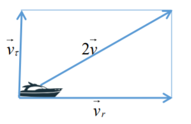
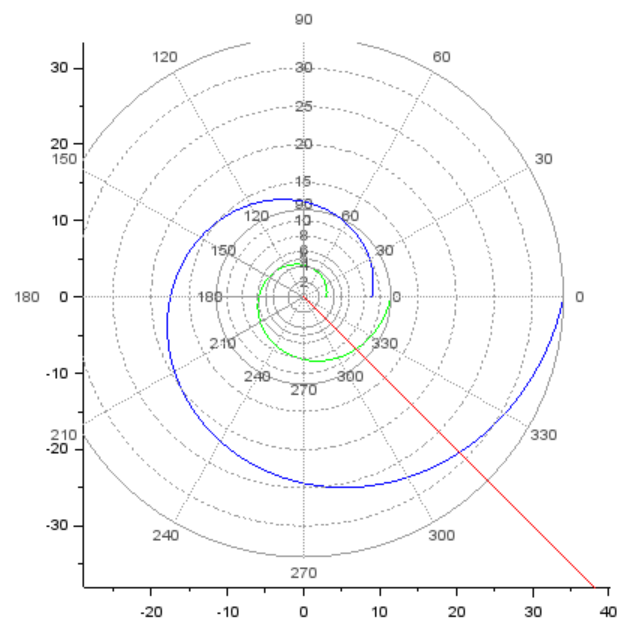

# Лабораторная работа №2
## Nikita A. Toponen
## RUDN University, 15 February 2022 Moscow, Russia

--- 

# Задача о погоне

---

### Прагматика выполнения работы

- Знакомство с основами математического моделирования на примере задачи о погоне.

- Визуализация результатов моделирования путем построения графиков.

---

### Цель выполнения работы

- Научиться строить математические модели для выбора правильной стратегии при решении задачи поиска на примере задачи о погоне.

- Научиться решать уравнения и строить графики в системе Scilab

---

### Постановка задачи лабораторной работы

- На море в тумане катер береговой охраны преследует лодку браконьеров. Через определенный промежуток времени туман рассеивается, и лодка обнаруживается на расстоянии 17,4 км от катера. 
Затем лодка снова скрывается в тумане и уходит прямолинейно в неизвестном направлении. Известно, что скорость катера в 4,8 раза больше скорости браконьерской лодки.

---

### Задания для выполнения

1. Записать уравнение, описывающее движение катера, с начальными условиями для двух случаев (в зависимости от расположения катера относительно лодки в начальный момент времени).
2. Построить траекторию движения катера и лодки для двух случаев.
3. Найти точку пересечения траектории катера и лодки.

---

# Выполнение работы

---

### Вывод уравнения 1/6

- Пусть через время $t$ катер и лодка окажутся на одном расстоянии $x$ от полюса. За это время лодка пройдет $x$, а катер — $k - x$ (или $k + x$ в зависимости от начального положения катера относительно полюса). Время, за которое они пройдут это расстояние, вычисляется как $x/v$ или ${k-x}/4.8v$ (во втором случае ${k+x}/4.8v$). Так как время одно и то же, то эти величины одинаковы.

---

### Вывод уравнения 2/6

- Тогда неизвестное расстояние $x$ можно найти из следующего уравнения:
   $$ \frac{x}{v} = \frac{k-x}{4.8v}\ в\ первом \ случае$$
   или
   $$ \frac{x}{v} = \frac{k+x}{4.8v}\ во\ втором.$$

Отсюда мы найдем два значения $x_1 = \frac{17.4}{5.8}\ = 3$ и $x_2 = \frac{17.4}{3.8}\ = \frac{8.7}{1.9}$ , задачу будем решать для двух случаев.

---

### Вывод уравнения 3/6

- После того, как катер береговой охраны окажется на одном расстоянии от полюса, что и лодка, он должен сменить прямолинейную траекторию и начать двигаться вокруг полюса, удаляясь от него со скоростью лодки $v$. Для этого скорость катера раскладываем на две составляющие: $v_r$ — радиальная скорость и $v_{\tau}$ — тангенциальная скорость (рис. 2). Радиальная скорость - это скорость, с которой катер удаляется от полюса, $v_r = \frac{dr}{dt}$. Нам нужно, чтобы эта скорость была равна скорости лодки, поэтому полагаем $\frac{dr}{dt}=v$.

---

### Вывод уравнения 4/6

- Тангенциальная скорость – это линейная скорость вращения катера относительно полюса. Она равна произведению угловой скорости $\frac{\partial \theta}{\partial t}$ на радиус $r,\ v_{\tau} = r \frac{\partial \theta}{\partial t}$

Из рисунка (рис. 1) видно: $v_{\tau} = \sqrt{23.04v^2 - v^2} = \sqrt{22.04}v$ (учитывая, что радиальная скорость равна $v$). Тогда получаем $r \frac{\partial \theta}{\partial t} = \sqrt{22.04}v$

#### рис.1 Разложение скорости на радиальную и тангенциальную

---

### Вывод уравнения 5/6
- Решение исходной задачи сводится к решению системы из двух дифференциальных уравнений: 

$\begin{equation} 
  \begin{cases} 
    \frac{\partial r}{\partial t} = v 
    \\
    r \frac{\partial \theta}{\partial t} = \sqrt{22.04} v 
  \end{cases}
\end{equation}$

с начальными условиями 

1. $\begin{equation}
  \begin{cases}
    \theta_0 = 0 
    \\ 
    r_0 = 3 
  \end{cases}
\end{equation}$

2. $\begin{equation}
  \begin{cases}
    \theta_0 = -\pi
    \\
    r_0 = \frac{8.7}{1.9}
  \end{cases}
\end{equation}$

---

### Вывод уравнения 6/6

Исключая из полученной системы производную по $t$, можно перейти к следующему уравнению:
$$ \frac{\partial r}{\partial \theta} = \frac{r}{\sqrt{22.04}}.$$
Начальные условия остаются прежними. Решив это уравнение, мы получим траекторию движения катера в полярных координатах.

---

### Результаты выполнения работы

#### рис.2 Графики

---

# Спасибо за внимание!
