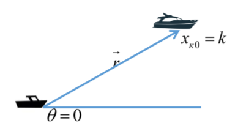
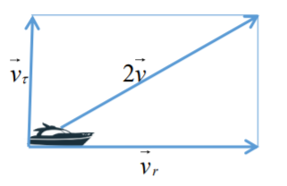
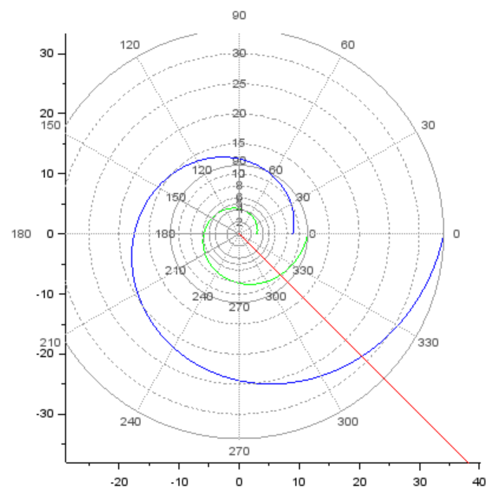

---
# Front matter
title: "Лабораторная работа №2"
subtitle: "Задача о погоне"
author: "Топонен Никита Андреевич"

# Formatting
toc-title: "Содержание"
toc: true # Table of contents
toc_depth: 2
lof: true # List of figures
lot: true # List of tables
fontsize: 12pt
linestretch: 1.5
papersize: a4paper
documentclass: scrreprt
polyglossia-lang: russian
polyglossia-otherlangs: english
mainfont: PT Serif
romanfont: PT Serif
sansfont: PT Sans
monofont: PT Mono
mainfontoptions: Ligatures=TeX
romanfontoptions: Ligatures=TeX
sansfontoptions: Ligatures=TeX,Scale=MatchLowercase
monofontoptions: Scale=MatchLowercase
indent: true
pdf-engine: xelatex
header-includes:
  - \linepenalty=10 # the penalty added to the badness of each line within a paragraph (no associated penalty node) Increasing the value makes tex try to have fewer lines in the paragraph.
  - \interlinepenalty=0 # value of the penalty (node) added after each line of a paragraph.
  - \hyphenpenalty=50 # the penalty for line breaking at an automatically inserted hyphen
  - \exhyphenpenalty=50 # the penalty for line breaking at an explicit hyphen
  - \binoppenalty=700 # the penalty for breaking a line at a binary operator
  - \relpenalty=500 # the penalty for breaking a line at a relation
  - \clubpenalty=150 # extra penalty for breaking after first line of a paragraph
  - \widowpenalty=150 # extra penalty for breaking before last line of a paragraph
  - \displaywidowpenalty=50 # extra penalty for breaking before last line before a display math
  - \brokenpenalty=100 # extra penalty for page breaking after a hyphenated line
  - \predisplaypenalty=10000 # penalty for breaking before a display
  - \postdisplaypenalty=0 # penalty for breaking after a display
  - \floatingpenalty = 20000 # penalty for splitting an insertion (can only be split footnote in standard LaTeX)
  - \raggedbottom # or \flushbottom
  - \usepackage{float} # keep figures where there are in the text
  - \floatplacement{figure}{H} # keep figures where there are in the text

---

# Цель работы

Научиться строит математические модели для выбора правильной стратегии при решении задачи поиска на примере задачи о погоне, а также научиться решать уравнения и строить графики движения.

# Задание

**Вариант 41**

На море в тумане катер береговой охраны преследует лодку браконьеров. Через определенный промежуток времени туман рассеивается, и лодка обнаруживается на расстоянии 17,4 км от катера. Затем лодка снова скрывается в тумане и уходит прямолинейно в неизвестном направлении. Известно, что скорость катера в 4,8 раза больше скорости браконьерской лодки. 

 1. Запишите уравнение, описывающее движение катера, с начальными условиями для двух случаев (в зависимости от расположения катера относительно лодки в начальный момент времени). 
 2. Постройте траекторию движения катера и лодки для двух случаев. 
 3. Найдите точку пересечения траектории катера и лодки 

# Выполнение лабораторной работы

## Постановка задачи

1. Место нахождения лодки браконьеров в момент обнаружения: $t_0 = 0, x_{л0} = 0$. Место нахождения катера береговой охраны относительно лодки браконьеров в момент обнаружения лодки: $x_{к0} = 17.4$


2. Введем полярные координаты. Считаем, что полюс - это точка обнаружения лодки браконьеров $x_{л0} (0 = x_{л0} = 0)$, а полярная ось r проходит через точку нахождения катера береговой охраны (рис. -@fig:001)

{ #fig:001 width=70% }

3. Траектория катера должна быть такой, чтобы и катер, и лодка все время были на одном расстоянии от полюса, только в этом случае траектория катера пересечется с траекторией лодки. Поэтому для начала катер береговой охраны должен двигаться некоторое время прямолинейно, пока не окажется на том же расстоянии от полюса, что и лодка браконьеров. После этого катер береговой охраны должен двигаться вокруг полюса удаляясь от него с той же скоростью, что и лодка браконьеров.


4. Чтобы найти расстояние $x$ (расстояние, после которого катер начнет двигаться вокруг полюса), необходимо составить простое уравнение. Пусть через время $t$ катер и лодка окажутся на одном расстоянии $x$ от полюса. За это время лодка пройдет $x$, а катер — $k - x$ (или $k + x$ в зависимости от начального положения катера относительно полюса). Время, за которое они пройдут это расстояние, вычисляется как $x/v$ или ${k-x}/4.8v$ (во втором случае ${k+x}/4.8v$). Так как время одно и то же, то эти величины одинаковы. Тогда неизвестное расстояние $x$ можно найти из следующего уравнения:
   $$ \frac{x}{v} = \frac{k-x}{4.8v}\ в\ первом \ случае$$
   или
   $$ \frac{x}{v} = \frac{k+x}{4.8v}\ во\ втором.$$

Отсюда мы найдем два значения $x_1 = \frac{17.4}{5.8}\ = 3$ и $x_2 = \frac{17.4}{3.8}\ = \frac{8.7}{1.9}$ , задачу будем решать для двух случаев.


5. После того, как катер береговой охраны окажется на одном расстоянии от полюса, что и лодка, он должен сменить прямолинейную траекторию и начать двигаться вокруг полюса, удаляясь от него со скоростью лодки $v$. Для этого скорость катера раскладываем на две составляющие: $v_r$ — радиальная скорость и $v_{\tau}$ — тангенциальная скорость (рис. 2). Радиальная скорость - это скорость, с которой катер удаляется от полюса, $v_r = \frac{dr}{dt}$. Нам нужно, чтобы эта скорость была равна скорости лодки, поэтому полагаем $\frac{dr}{dt}=v$.

Тангенциальная скорость – это линейная скорость вращения катера относительно полюса. Она равна произведению угловой скорости $\frac{\partial \theta}{\partial t}$ на радиус $r,\ v_{\tau} = r \frac{\partial \theta}{\partial t}$

Из рисунка (рис. -@fig:002) видно: $v_{\tau} = \sqrt{23.04v^2 - v^2} = \sqrt{22.04}v$ (учитывая, что радиальная скорость равна $v$). Тогда получаем $r \frac{\partial \theta}{\partial t} = \sqrt{22.04}v$

{ #fig:002 width=70% }

6. Решение исходной задачи сводится к решению системы из двух дифференциальных уравнений: 

$\begin{equation} 
  \begin{cases} 
    \frac{\partial r}{\partial t} = v 
    \\
    r \frac{\partial \theta}{\partial t} = \sqrt{22.04} v 
  \end{cases}
\end{equation} $

с начальными условиями 

$\begin{equation}
  \begin{cases}
    \theta_0 = 0 
    \\ 
    r_0 = 3 
  \end{cases}
\end{equation}$

$\begin{equation}
  \begin{cases}
    \theta_0 = -\pi
    \\
    r_0 = \frac{8.7}{1.9}
  \end{cases}
\end{equation} $

Исключая из полученной системы производную по $t$, можно перейти к следующему уравнению:
$$ \frac{\partial r}{\partial \theta} = \frac{r}{\sqrt{22.04}}.$$
Начальные условия остаются прежними. Решив это уравнение, мы получим траекторию движения катера в полярных координатах.

## Построение траектории движения и точки пересечения

Код для обоих случаев в Scilab:

```matlab
s=17,4;//начальное расстояние от лодки до катера
fi=3*%pi/4;//направление движения лодки в полярных координатах

//функция, описывающая движение катера береговой охраны
function dr = f(tetha,r)
    dr=r/sqrt(22.04);
endfunction;

//начальное условие в случае 1
r0_1=3;
tetha0_1=0;

//начальное условие в случае 2
r0_2=8.7/1.9;
tetha0_2=-%pi;

//тета изменяется от 0 до 2пи с шагом 0.01
tetha=0:0.01:2*%pi;

//решение диф. ур. в случае 1
r_1=ode(r0_1,tetha0_1,tetha,f);

//решение диф. ур. в случае 2
r_2=ode(r0_2,tetha0_2,tetha,f);

//функция, описывающая движение лодки браконьеров
function xt=f2(t)
    xt=tan(fi)*t;
endfunction

//время изменяется от 0 до 800 с шагом 1
t=0:1:800;

polarplot(tetha,r_1,style=color('green'));//траектория движения катера в полярных координатах с начальными условиями 1
polarplot(tetha,r_2,style=color('blue'));//траектория движения катера в полярных координатах с начальными условиями 2
plot2d(t,f2(t),style=color('red'));//тракетория движения лодки браконьеров

```


Графики движения и точки пересечения. Зелёным цветом — охрана в первом случае, синим цветом — охрана во втором случае, красным — браконьеры. (рис. -@fig:003)

{ #fig:003 width=70% }

В первом случае браконьеры проехали 9.75 метров. Во втором случае браконьеры проехали 30.26 метров.

# Выводы

  1. Записал уравнение, описывающее движение катера, с начальными условиями для двух случаев (в зависимости от расположения катера относительно лодки в начальный момент времени).
  2. Построил траекторию движения катера и лодки для двух случаев.
  3. Нашел точки пересечения траектории катера и лодки для двух случаев. 
  4. Научился решать задачу о погоне, строить графики.

# Библиография

- <code>[Кулябов Д. С. *Лабораторная работа №2*](https://esystem.rudn.ru/mod/resource/view.php?id=831032)</code>

- <code>[Кулябов Д. С. *Задания к лабораторной работе №2 ( по вариантам )*](https://esystem.rudn.ru/mod/resource/view.php?id=831033)</code>