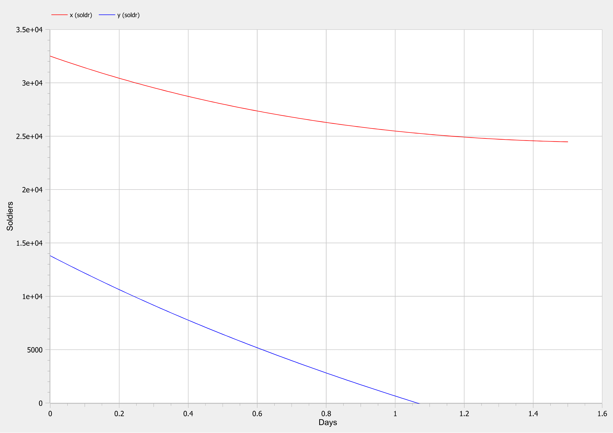
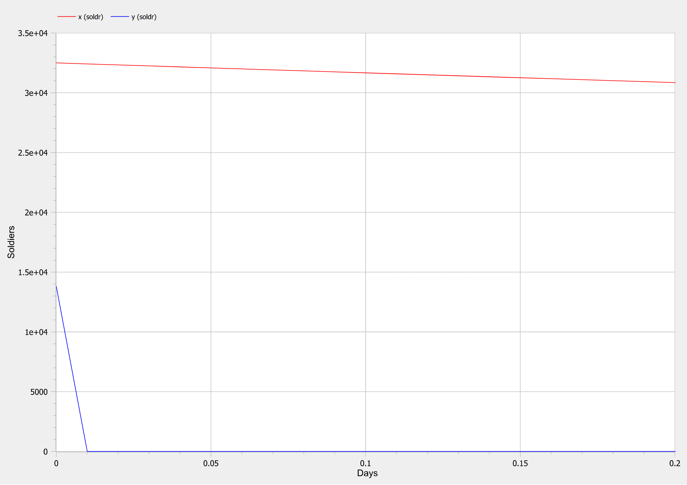

<style>
img[alt="center"] {
     display: block;
     margin: 0 auto;
}
h1 {
    font-size: 60px;
    text-align: center;
}
h2 {
    font-size: 30px;
    text-align: left;
    position: relative;
    left: -2em;
    line-height: 0px;
    top: 8em;
}
h3 {
    font-size: 40px;
    text-align: left;
    position: relative;
    left: -0.5em;
    bottom: 0.2em;
}
h4 {
    font-size: 25px;
    text-align: center;
    position: relative;
    left: -0.5em;
    bottom: 0.2em;
}
</style>

# Лабораторная работа №3
## Nikita A. Toponen
## RUDN University, 22 February 2022 Moscow, Russia

--- 

# Модель боевых действий

---

### Прагматика выполнения работы

- Знакомство с основами математического моделирования на примере простейшей модели боевых действий.

- Визуализация результатов моделирования путем построения графиков.

---

### Цель выполнения работы

- Научиться строить простейшие математические модели боевых действий - модели Ланчестера(Осипова - Ланчестера).

- Научиться решать систему дифференциальных уравнений и строить графики в системе моделирование OpenModelica.

---

### Постановка задачи лабораторной работы

##### *Вариант 41*
- Между страной $X$ и страной $Y$ идет война. Численность состава войск исчисляется от начала войны, и являются временными функциями $x(t)$ и $y(t)$. В начальный момент времени страна $X$ имеет армию численностью *32 500* человек, а в распоряжении страны $Y$ армия численностью в *13 800* человек. Для упрощения модели считаем, что коэффициенты $a$, $b$, $c$, $h$ постоянны. Также считаем $P(t)$ и $Q(t)$ непрерывные функции.

---

### Задания для выполнения

Постройте графики изменения численности войск армии $X$ и армии $Y$ для следующих случаев:
1. Модель боевых действий между регулярными войсками:

   $\frac{dx}{dt}=-0.12x(t)-0.54y(t)+|sin(t+1)|$

   $\frac{dy}{dt}=-0.4x(t)-0.27y(t)+|cos(t+2)|$

2. Модель ведение боевых действий с участием регулярных войск и партизанских отрядов:

   $\frac{dx}{dt}=-0.26x(t)-0.8y(t)+|sin(2t)|$

   $\frac{dy}{dt}=-0.62x(t)-0.13y(t)+|cos(t)|$

---

# Выполнение работы

---

### Код для первого случая
``` matlab
model lab03_var1

  type Soldier=Real(unit="soldr", min=0)"тип Солдат с минимальным значением 0";
  type Day=Real(unit="d", min=0)"тип День с минимальным значением 0";
  
  parameter Day t"параметр времени t";

  constant Real a=0.12"степень влияния различных факторов на потери";
  constant Real b=0.54"эффективность боевых действий армии Y";
  constant Real c=0.4"эффективность боевых действий армии X";
  constant Real h=0.27"степень влияния различных факторов на потери";
  
  Real p"размер подкрепления к армии X";
  Real q"размер подкрепления к армии Y";
  Soldier x"численность армии X";
  Soldier y"численность армии Y";

  
initial equation
  x=32500"начальная численность армии X";
  y=13800"начальная численность армии Y";
  t=0"стартовое время";
  
equation
  p=abs(sin(t+1))"функция, рассчитывающая подкрепление к армии X";
  q=abs(cos(t+2))"функция, рассчитывающая подкрепление к армии Y";
  der(x)=-a*x-b*y+p"первое дифференциальное уравнение системы";
  der(y)=-c*x-h*y+q"второе дифференциальное уравнение системы";

end lab03_var1;
```

---

### Результаты первой модели

Для первого случая получаем:


#### Рис.1 Графики для первого случая

---

### Код для второго случая
``` matlab
model lab03_var2

  type Soldier=Real(unit="soldr", min=0)"тип Солдат с минимальным значением 0";
  type Day=Real(unit="d", min=0)"тип День с минимальным значением 0";
  
  parameter Day t"параметр времени t";

  constant Real a=0.26"степень влияния различных факторов на потери";
  constant Real b=0.8"эффективность боевых действий армии Y";
  constant Real c=0.62"эффективность боевых действий армии X";
  constant Real h=0.13"степень влияния различных факторов на потери";
  
  Real p"размер подкрепления к армии X";
  Real q"размер подкрепления к армии Y";
  Soldier x"численность армии X";
  Soldier y"численность армии Y";

  
initial equation
  x=32500"начальная численность армии X";
  y=13800"начальная численность армии Y";
  t=0"стартовое время";
  
equation
  p=abs(sin(2*t))"функция, рассчитывающая подкрепление к армии X";
  q=abs(cos(t))"функция, рассчитывающая подкрепление к армии Y";
  der(x)=-a*x-b*y+p"первое дифференциальное уравнение системы";
  der(y)=-c*x*y-h*y+q"второе дифференциальное уравнение системы";

end lab03_var2;
```

---

### Результаты второй модели

Для второго случая получаем:


#### Рис.2 Графики для второго случая

---

# Спасибо за внимание!
