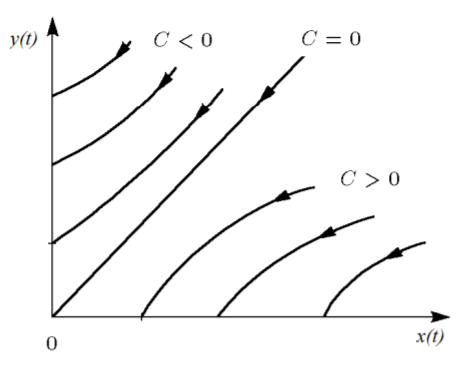
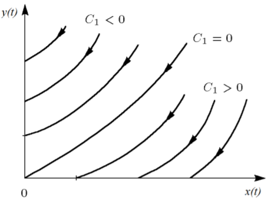
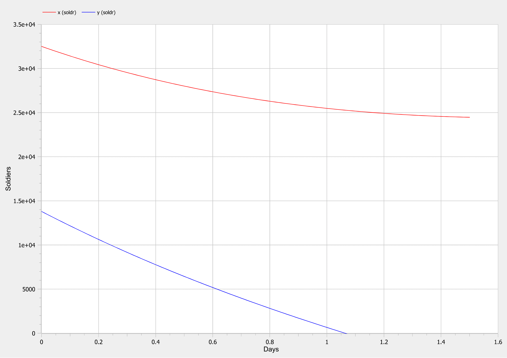

---
# Front matter
title: "Лабораторная работа №3"
subtitle: "Модель боевых действий"
author: "Топонен Никита Андреевич"

# Formatting
toc-title: "Содержание"
toc: true # Table of contents
toc_depth: 2
lof: true # List of figures
lot: true # List of tables
fontsize: 12pt
linestretch: 1.5
papersize: a4paper
documentclass: scrreprt
polyglossia-lang: russian
polyglossia-otherlangs: english
mainfont: PT Serif
romanfont: PT Serif
sansfont: PT Sans
monofont: PT Mono
mainfontoptions: Ligatures=TeX
romanfontoptions: Ligatures=TeX
sansfontoptions: Ligatures=TeX,Scale=MatchLowercase
monofontoptions: Scale=MatchLowercase
indent: true
pdf-engine: xelatex
header-includes:
  - \linepenalty=10 # the penalty added to the badness of each line within a paragraph (no associated penalty node) Increasing the value makes tex try to have fewer lines in the paragraph.
  - \interlinepenalty=0 # value of the penalty (node) added after each line of a paragraph.
  - \hyphenpenalty=50 # the penalty for line breaking at an automatically inserted hyphen
  - \exhyphenpenalty=50 # the penalty for line breaking at an explicit hyphen
  - \binoppenalty=700 # the penalty for breaking a line at a binary operator
  - \relpenalty=500 # the penalty for breaking a line at a relation
  - \clubpenalty=150 # extra penalty for breaking after first line of a paragraph
  - \widowpenalty=150 # extra penalty for breaking before last line of a paragraph
  - \displaywidowpenalty=50 # extra penalty for breaking before last line before a display math
  - \brokenpenalty=100 # extra penalty for page breaking after a hyphenated line
  - \predisplaypenalty=10000 # penalty for breaking before a display
  - \postdisplaypenalty=0 # penalty for breaking after a display
  - \floatingpenalty = 20000 # penalty for splitting an insertion (can only be split footnote in standard LaTeX)
  - \raggedbottom # or \flushbottom
  - \usepackage{float} # keep figures where there are in the text
  - \floatplacement{figure}{H} # keep figures where there are in the text
---

# Цель работы

Рассмотреть некоторые простейшие модели боевых действий – ***модели Ланчестера*** (Осипова — Ланчестера). А также их программную реализацию.

# Задание

**Вариант 41**

Между страной $X$ и страной $Y$ идет война. Численность состава войск исчисляется от начала войны, и являются временными функциями $x(t)$ и $y(t)$. В начальный момент времени страна $X$ имеет армию численностью *32 500* человек, а в распоряжении страны $Y$ армия численностью в *13 800* человек. Для упрощения модели считаем, что коэффициенты $a$, $b$, $c$, $h$ постоянны. Также считаем $P(t)$ и $Q(t)$ непрерывные функции.

Постройте графики изменения численности войск армии $X$ и армии $Y$ для следующих случаев:

1. Модель боевых действий между регулярными войсками:

   $\frac{dx}{dt}=-0.12x(t)-0.54y(t)+|sin(t+1)|$

   $\frac{dy}{dt}=-0.4x(t)-0.27y(t)+|cos(t+2)|$

2. Модель ведение боевых действий с участием регулярных войск и партизанских отрядов:

   $\frac{dx}{dt}=-0.26x(t)-0.8y(t)+|sin(2t)|$

   $\frac{dy}{dt}=-0.62x(t)-0.13y(t)+|cos(t)|$

# Теоретическое введение

**Законы Ланчестера** (законы Осипова — Ланчестера) — математическая формула для расчета относительных сил пары сражающихся сторон — подразделений вооруженных сил. 

- В статье «Влияние численности сражающихся сторон на их потери», опубликованной журналом «Военный сборник» в 1915 году, генерал-майор Корпуса военных топографов М. П. Осипов описал математическую модель глобального вооружённого противостояния, практически применяемую в военном деле при описании убыли сражающихся сторон с течением времени и, входящую в математическую теорию исследования операций, на год опередив английского математика Ф. У. Ланчестера.
- В 1916 году, в разгар первой мировой войны, Фредерик Ланчестер разработал систему дифференциальных уравнений для демонстрации соотношения между противостоящими силами. Среди них есть так называемые Линейные законы Ланчестера (первого рода или честного боя, для рукопашного боя или неприцельного огня) и Квадратичные законы Ланчестера (для войн начиная с XX века с применением прицельного огня, дальнобойных орудий, огнестрельного оружия). 
- В современных боевых действиях, когда боевые единицы сторон удалены друг от друга и ведут прицельный огонь, они способны поражать несколько целей, и могут поражаться с нескольких направлений. Коэффициент убыли (rate of attrition) зависит теперь только от количества боевых единиц, ведущих огонь. Ланчестер установил, что мощность группировки в этом случае пропорциональна не количеству боевых единиц, которое она имеет, а квадрату от числа единиц. Это называется *квадратичным законом Ланчестера*. Точнее, закон определяет потери боевых единиц, которые сражающаяся сторона нанесет за определенный период времени, по сравнению с теми, которые нанесет противостоящая сторона.

*Замечание:* в связи с установленным приоритетом в англоязычной литературе наметилась тенденция перехода от фразы «модель Ланчестера» к «модели Осипова — Ланчестера».

# Выполнение лабораторной работы

## 1. Постановка задачи

Рассмотрим некоторые простейшие модели боевых действий – модели Ланчестера (Осипова — Ланчестера). В противоборстве могут принимать участие как регулярные войска, так и партизанские отряды. В общем случае главной характеристикой соперников являются численности сторон. Если в какой-то момент времени одна из численностей обращается в нуль, то данная сторона считается проигравшей (при условии, что численность другой стороны в данный момент положительна).

Рассмотрим два случая ведения боевых действий:

1. Боевые действия между регулярными войсками.
2. Боевые действия с участием регулярных войск и партизанских отрядов.

### 1.1. Боевые действия между регулярными войсками

#### Модель

В первом случае численность регулярных войск определяется тремя факторами:

- скорость уменьшения численности войск из-за причин, не связанных с боевыми действиями (болезни, травмы, дезертирство).
- скорость потерь, обусловленных боевыми действиями противоборствующих сторон (что связанно с качеством стратегии, уровнем вооружения, профессионализмом солдат и т.п.).
- скорость поступления подкрепления (задаётся некоторой функцией от времени).

В этом случае модель боевых действий между регулярными войсками описывается следующим образом:

$\frac{dx}{dt}=-a(t)x(t)-b(t)y(t)+P(t)$

$\frac{dy}{dt}=-c(t)x(t)-h(t)y(t)+Q(t)$

*Пояснение:*

- члены $-a(t)x(t)$ и $-h(t)y(t)$ описывают потери, не связанные с боевыми действиями, где:
  - $a(t)$ и $h(t)$ - величины, характеризующие степень влияния различных факторов на потери.
- члены $-b(t)y(t)$ и $-c(t)x(t)$ отражают потери на поле боя, где:
  - $b(t)$ и $c(t)$ - величины, которые указывают на эффективность боевых действий со стороны $y$ и $x$ соответственно.
- функции $P(t)$ и $Q(t)$ учитывают возможность подхода подкрепления к войскам $X$ и $Y$ в течение одного дня.

#### Решение модели

В простейшей модели борьбы двух противников:

- коэффициенты $b(t)$ и $c(t)$ являются постоянными.

  *Пояснение:* попросту говоря, предполагается, что каждый солдат армии $x$ убивает за единицу времени $c$ солдат армии $y$ (и, соответственно, каждый солдат армии $y$ убивает $b$ солдат армии $x$).

- не учитываются потери, не связанные с боевыми действиями.

- не учитывается возможность подхода подкрепления.

Состояние системы описывается точкой $(x,y)$ положительного квадранта плоскости. Координаты этой точки, $x$ и $y$ - это численности противостоящих армий. Тогда модель принимает вид:

$\begin{cases} \stackrel{.}{x}=-by \\ \stackrel{.}{x=y}=-cx \end{cases}$

Это жесткая модель, которая допускает точно решение:

$\frac{dx}{dy}=\frac{by}{cx}$

$cxdx=bydy$, $cx^2-by^2=C$

Эволюция численностей армий x и y происходит вдоль гиперболы, заданной этим уравнением (рис. [-@fig:001]). По какой именно гиперболе пойдет война, зависит от начальной точки:

{#fig:001 width=70%}

 Эти гиперболы разделены прямой $\sqrt{c}x=\sqrt{b}y$ :

- Если начальная точка лежит выше этой прямой, то гипербола выходит на ось $y$, т.е. побеждают партизаны.

  *Пояснение:* это значит, что в ходе войны численность армии $x$ уменьшается до нуля (за конечное время). Армия $y$ выигрывает, противник уничтожен.

- Если начальная точка лежит ниже этой прямой, то гипербола выходит на ось $x$, т.е. побеждает регулярная армия.

  *Пояснение:* это значит, что в ходе войны численность армии $y$ уменьшается до нуля (за конечное время). Армия $x$ выигрывает, противник уничтожен.

- Если начальная точка лежит на прямой, то война заканчивается истреблением обеих армий.

  *Пояснение:* но на это требуется бесконечно большое время: конфликт продолжает тлеть, когда оба противника уже обессилены.

### 1.2. Боевые действия с участием регулярных войск и партизанских отрядов

#### Модель

Во втором случае в борьбу добавляются партизанские отряды. Нерегулярные войска в отличии от постоянной армии менее уязвимы, так как действуют скрытно, в этом случае сопернику приходится действовать неизбирательно, по площадям, занимаемым партизанами. Поэтому считается, что тем потерь партизан, проводящих свои операции в разных местах на некоторой известной территории, пропорционален не только численности армейских соединений, но и численности самих партизан. 

В результате модель принимает вид:

$\frac{dx}{dt}=-a(t)x(t)-b(t)y(t)+P(t)$

$\frac{dy}{dt}=-c(t)x(t)y(t)-h(t)y(t)+Q(t)$

*Пояснение:*

- члены $-a(t)x(t)$ и $-h(t)y(t)$ описывают потери, не связанные с боевыми действиями, где:
  - $a(t)$ и $h(t)$ - величины, характеризующие степень влияния различных факторов на потери.
- члены $-b(t)y(t)$ и $-c(t)x(t)$ отражают потери на поле боя, где:
  - $b(t)$ и $c(t)$ - величины, которые указывают на эффективность боевых действий со стороны $y$ и $x$ соответственно.
- функции $P(t)$ и $Q(t)$ учитывают возможность подхода подкрепления к войскам $X$ и $Y$ в течение одного дня.

#### Решение модели

В простейшей модели борьбы двух противников:

- коэффициенты $b(t)$ и $c(t)$ являются постоянными.

  *Пояснение:* Попросту говоря, предполагается, что каждый солдат армии $x$ убивает за единицу времени $c$ солдат армии $y$ (и, соответственно, каждый солдат армии $y$ убивает $b$ солдат армии $x$).

- не учитываются потери, не связанные с боевыми действиями.

- не учитывается возможность подхода подкрепления.

Если рассматривать второй случай с теми же упрощениями, то модель принимает вид:

$\frac{dx}{dt}=-by(t)$

$\frac{dy}{dt}=-cx(t)y(t)$

Эта система приводится к уравнению:

$\frac{d}{dt}(\frac{b}{2}x^2(t)-cy(t))=0$,

которое при заданных начальных условиях имеет единственное решение (рис. [-@fig:002]):

$\frac{b}{2}x^2(t)-cy(t)=\frac{b}{2}x^2(0)-cy(0)=C_1$

{#fig:002 width=70%}

Эти гиперболы разделены параболой $\frac{b}{2}x^2(0)=cy(0)$ :

- при $C_1<0$ побеждают партизаны.

  *Пояснение:* это значит, что в ходе войны численность армии $x$ уменьшается до нуля (за конечное время). Армия $y$ выигрывает, противник уничтожен.

- при $C_1>0$ побеждает регулярная армия.

  *Пояснение:* это значит, что в ходе войны численность армии $y$ уменьшается до нуля (за конечное время). Армия $x$ выигрывает, противник уничтожен.

## 2. Построение графиков изменения численности войск

### 2.1. Боевые действия между регулярными войсками

1. Код программы с комментариями:

   ```matlab
   model lab03_var1
   
     type Soldier=Real(unit="soldr", min=0)"тип Солдат с минимальным значением 0";
     type Day=Real(unit="d", min=0)"тип День с минимальным значением 0";
     
     parameter Day t"параметр времени t";
   
     constant Real a=0.12"степень влияния различных факторов на потери";
     constant Real b=0.54"эффективность боевых действий армии Y";
     constant Real c=0.4"эффективность боевых действий армии X";
     constant Real h=0.27"степень влияния различных факторов на потери";
     
     Real p"размер подкрепления к армии X";
     Real q"размер подкрепления к армии Y";
     Soldier x"численность армии X";
     Soldier y"численность армии Y";
   
     
   initial equation
     x=32500"начальная численность армии X";
     y=13800"начальная численность армии Y";
     t=0"стартовое время";
     
   equation
     p=abs(sin(t+1))"функция, рассчитывающая подкрепление к армии X";
     q=abs(cos(t+2))"функция, рассчитывающая подкрепление к армии Y";
     der(x)=-a*x-b*y+p"первое дифференциальное уравнение системы";
     der(y)=-c*x-h*y+q"второе дифференциальное уравнение системы";
   
   end lab03_var1;
   ```
   
2. График изменения численности войск армии $X$ и армии $Y$ (рис. [-@fig:003]):

   {#fig:003 width=70%}
   
   *Пояснение:* таким образом, глядя на график, можно сделать вывод, что регулярная армия $Y$ одержала победу над регулярной армией $X$, где:
   
   - <span style="color:red">красный</span> - регулярная армия $X$;
   - <span style="color:blue">синий</span> - регулярная армия $Y$;

### 2.2. Боевые действия с участием регулярных войск и партизанских отрядов

1. Код программы с комментариями:

   ```matlab
   model lab03_var2
   
     type Soldier=Real(unit="soldr", min=0)"тип Солдат с минимальным значением 0";
     type Day=Real(unit="d", min=0)"тип День с минимальным значением 0";
     
     parameter Day t"параметр времени t";
   
     constant Real a=0.26"степень влияния различных факторов на потери";
     constant Real b=0.8"эффективность боевых действий армии Y";
     constant Real c=0.62"эффективность боевых действий армии X";
     constant Real h=0.13"степень влияния различных факторов на потери";
     
     Real p"размер подкрепления к армии X";
     Real q"размер подкрепления к армии Y";
     Soldier x"численность армии X";
     Soldier y"численность армии Y";
   
     
   initial equation
     x=32500"начальная численность армии X";
     y=13800"начальная численность армии Y";
     t=0"стартовое время";
     
   equation
     p=abs(sin(2*t))"функция, рассчитывающая подкрепление к армии X";
     q=abs(cos(t))"функция, рассчитывающая подкрепление к армии Y";
     der(x)=-a*x-b*y+p"первое дифференциальное уравнение системы";
     der(y)=-c*x*y-h*y+q"второе дифференциальное уравнение системы";
   
   end lab03_var2;
   ```
   
2. График изменения численности войск армии $X$ и армии $Y$ (рис. [-@fig:004]):

   {#fig:004 width=70%}
   
   *Пояснение:* таким образом, глядя на график, можно сделать вывод, что регулярная армия $X$ одержала победу над партизанским отрядом $Y$, где:
   
   - <span style="color:red">красный</span> - регулярная армия $X$;
   - <span style="color:blue">синий</span> - партизанский отряд $Y$;

# Выводы

Благодаря данной лабораторной работе познакомился с простейшей моделью боевых действий - ***модели Ланчестера*** (Осипова — Ланчестера), а именно научился:

- строить модель для следующих двух случаев:
  - Модель боевых действий между регулярными войсками.
  - Модель ведение боевых действий с участием регулярных войск и партизанских отрядов.

- строить графики изменений численности войск армии $X$ и армии $Y$ для следующих двух случаев:
  - Модель боевых действий между регулярными войсками.
  - Модель ведение боевых действий с участием регулярных войск и партизанских отрядов.


# Список литературы

- <code>[Кулябов Д.С. *Лабораторная работа №3*](https://esystem.rudn.ru/mod/resource/view.php?id=831037)</code>

- <code>[Кулябов Д.С. *Задания к лабораторной работе №3 ( по вариантам )*](https://esystem.rudn.ru/mod/resource/view.php?id=831038)</code>

- <code>[Wikipedia *Законы Осипова-Ланчестера*](https://ru.wikipedia.org/wiki/Законы_Осипова_—_Ланчестера)</code>