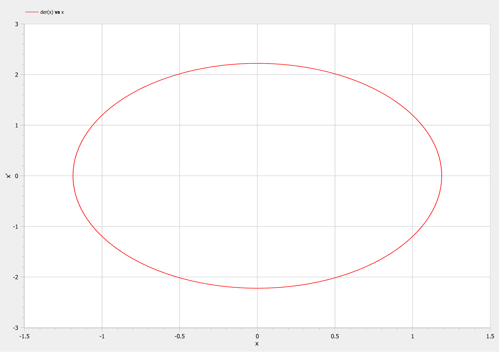
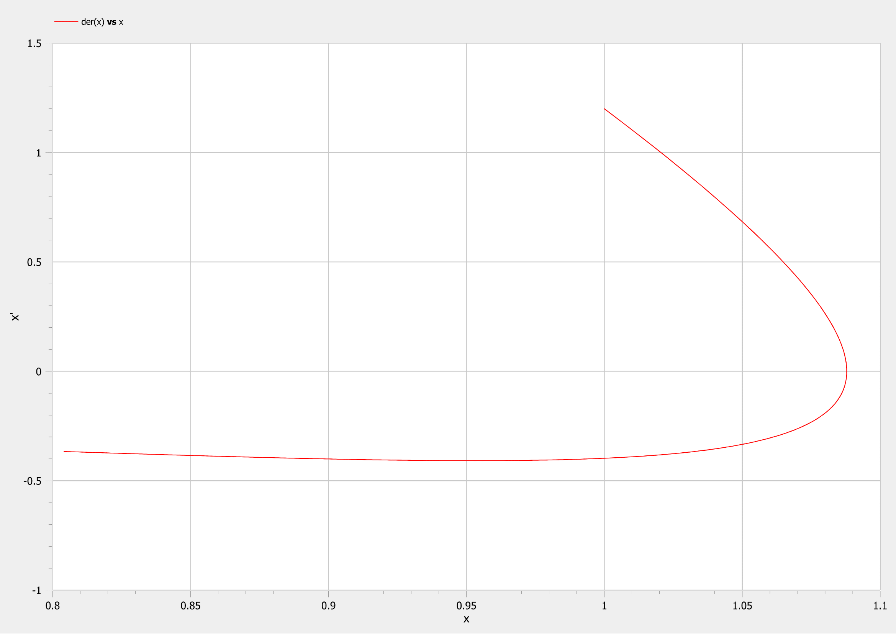
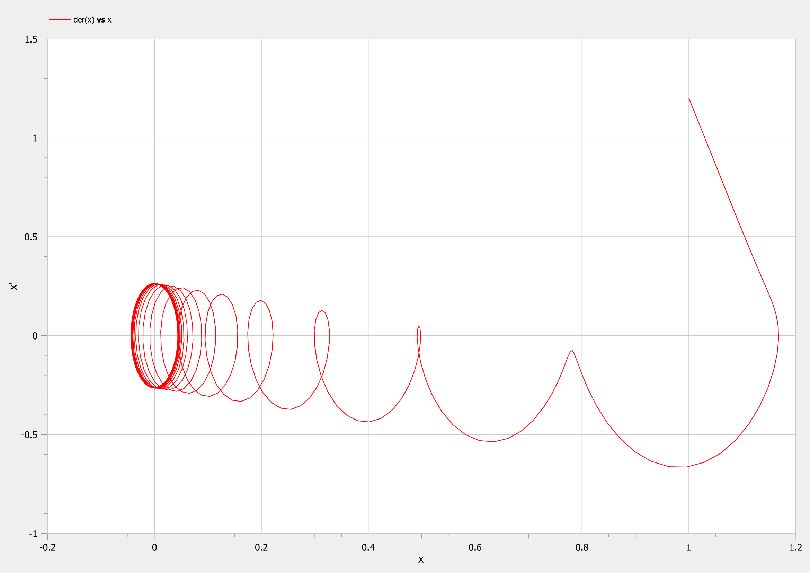

<style>
img[alt="center"] {
     display: block;
     margin: 0 auto;
}
h1 {
    font-size: 60px;
    text-align: center;
}
h2 {
    font-size: 30px;
    text-align: left;
    position: relative;
    left: -2em;
    line-height: 0px;
    top: 8em;
}
h3 {
    font-size: 40px;
    text-align: left;
    position: relative;
    left: -0.5em;
    bottom: 0.2em;
}
h4 {
    font-size: 25px;
    text-align: center;
    position: relative;
    left: -0.5em;
    bottom: 0.2em;
}
</style>

# Лабораторная работа №4
## Nikita A. Toponen
## RUDN University, 1 March 2022 Moscow, Russia

--- 

# Модель грамонических колебаний

---

### Прагматика выполнения работы

- Знакомство с моделями гармонических колебаний с затуханием и без, а также под действием внешних сил и без.

- Визуализация результатов моделирования путем построения фазовых портретов.

---

### Цель выполнения работы

- Научиться строить модели гармонических колебаний с затуханием и без, а также под действием внешних сил и без.

- Научиться решать систему дифференциальных уравнений и фазовые портреты в системе моделирование OpenModelica.

---

### Постановка задачи лабораторной работы

##### *Вариант 41*
Постройте фазовый портрет гармонического осциллятора и решение уравнения гармонического осциллятора для следующих случаев:

1. Колебания гармонического осциллятора без затуханий и без действий внешней силы $\ddot {x} + 3.5x = 0$
2. Колебания гармонического осциллятора c затуханием и без действий внешней силы $\ddot {x} + 7 \dot {x} + 3x = 0$
3. Колебания гармонического осциллятора c затуханием и под действием внешней силы $\ddot {x} + 5 \dot {x} + 2x = 2sin(6t)$

На интервале $t \in [0; 37]$(шаг 0.05) с начальными условиями $x_0 = 1, y_0 = 1.2$

---

# Выполнение работы

---

### Переход от уравнения к системе

1. Уравнение $\ddot {x} + 3.5x = 0$ приводится к системе вида: $\begin{cases} \dot{x} = y \\ \dot{y} = -3.5x \end{cases}$
2. Уравнение $\ddot {x} + 7 \dot {x} + 3x = 0$ приводится к системе вида: $\begin{cases} \dot{x} = y \\ \dot{y} = -7 y - 3x \end{cases}$
3. Уравнение $\ddot {x} + 5 \dot {x} + 2x = 2sin(6t)$ приводится к системе вида: $\begin{cases} \dot{x} = y \\ \dot{y} = -5y - 2x + 2sin(6t)\end{cases}$

---
### Код для первого случая
``` matlab
model lab04
  
  constant Real w=sqrt(3.5)"значение параметра w";
  
  Real x"переменная со значением x";
  Real y"переменная со значением y";
  
initial equation
  x=1"начальное значение x=x0";
  y=1.2"начальное значение y=y0";

equation
  der(x)=y"первое уравнение системы";
  der(y)=-w*w*x"второе уравнение системы";

end lab04;
```

---

### Результаты первой модели

Гармонические колебания без затухания и без действия внешних сил:


#### Рис.1 Фазовый портрет первой модели

---

### Код для второго случая
``` matlab
model lab04_2
  
  constant Real w=sqrt(3)"значение параметра омега";
  constant Real g=3.5"значение параметра гамма";
  
  Real x"переменная со значением x";
  Real y"переменная со значением y";
  
initial equation
  x=1"начальное значение x=x0";
  y=1.2"начальное значение y=y0";

equation
  der(x)=y"первое уравнение системы";
  der(y)=-2*g*y-w*w*x"второе уравнение системы";

end lab04_2;
```

---

### Результаты второй модели

Гармонические колебания с затуханием и без действия внешних сил:


#### Рис.2 Фазовый портрет второй модели

---
### Код для третьего случая
``` matlab
model lab04_3
  
  constant Real w=sqrt(2)"значение параметра омега";
  constant Real g=2.5"значение параметра гамма";
  
  Real x"переменная со значением x";
  Real y"переменная со значением y";
  Real f"переменная со значением f - действием внешних сил";
  
initial equation
  x=1"начальное значение x=x0";
  y=1.2"начальное значение y=y0";
  f=0"начальное значение f";

equation
  f=2*sin(6*time)"уравнение изменения действий сил в зависимости от времени";
  der(x)=y"первое уравнение системы";
  der(y)=-2*g*y-w*w*x+f"второе уравнение системы";

end lab04_3;
```

---

### Результаты третьей модели

Гармонические колебания с затуханием и под действием внешних сил:


#### Рис.2 Фазовый портрет третьей модели

---

# Спасибо за внимание!
