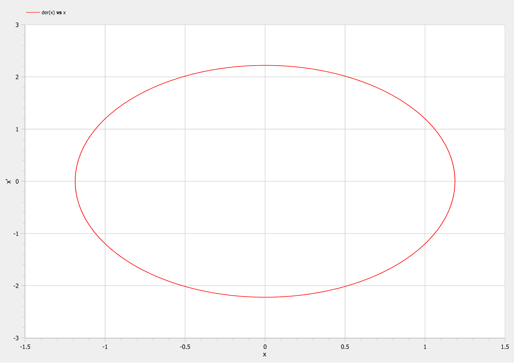
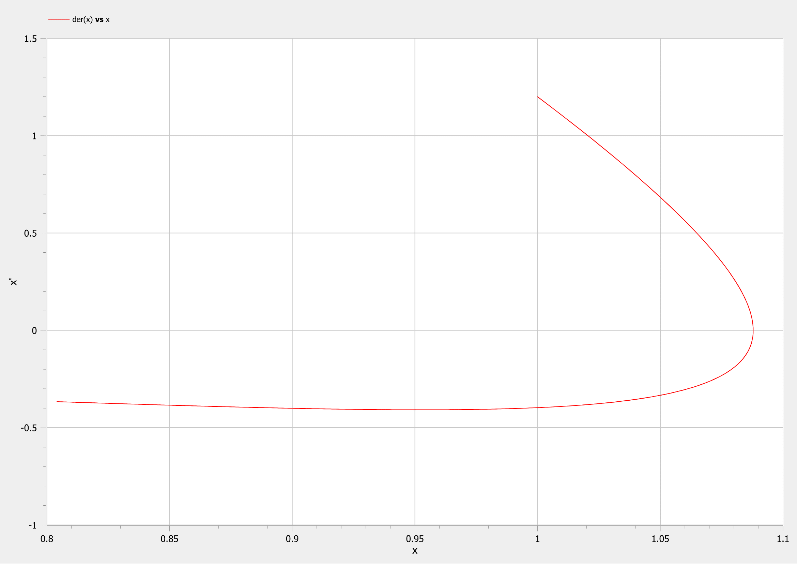
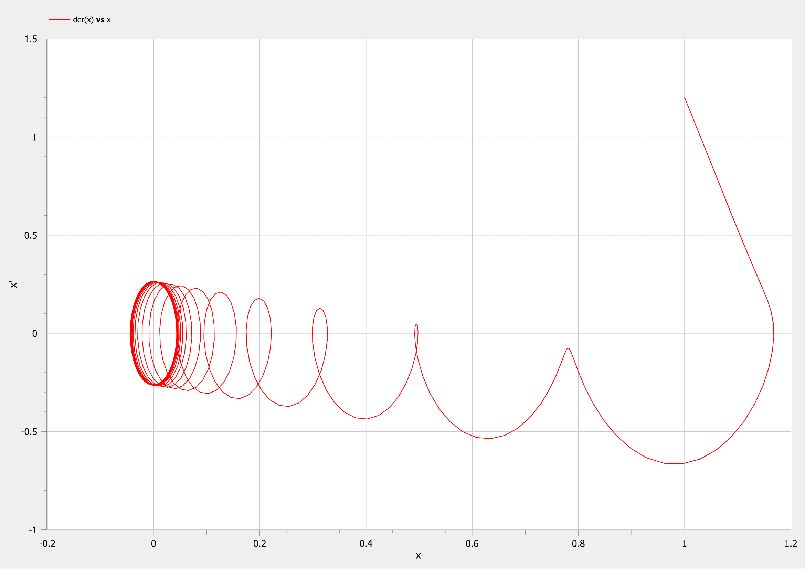

---
# Front matter
title: "Лабораторная работа №4"
subtitle: "Модель гармонических колебаний"
author: "Топонен Никита Андреевич"

# Formatting
toc-title: "Содержание"
toc: true # Table of contents
toc_depth: 2
lof: true # List of figures
lot: true # List of tables
fontsize: 12pt
linestretch: 1.5
papersize: a4paper
documentclass: scrreprt
polyglossia-lang: russian
polyglossia-otherlangs: english
mainfont: PT Serif
romanfont: PT Serif
sansfont: PT Sans
monofont: PT Mono
mainfontoptions: Ligatures=TeX
romanfontoptions: Ligatures=TeX
sansfontoptions: Ligatures=TeX,Scale=MatchLowercase
monofontoptions: Scale=MatchLowercase
indent: true
pdf-engine: xelatex
header-includes:
  - \linepenalty=10 # the penalty added to the badness of each line within a paragraph (no associated penalty node) Increasing the value makes tex try to have fewer lines in the paragraph.
  - \interlinepenalty=0 # value of the penalty (node) added after each line of a paragraph.
  - \hyphenpenalty=50 # the penalty for line breaking at an automatically inserted hyphen
  - \exhyphenpenalty=50 # the penalty for line breaking at an explicit hyphen
  - \binoppenalty=700 # the penalty for breaking a line at a binary operator
  - \relpenalty=500 # the penalty for breaking a line at a relation
  - \clubpenalty=150 # extra penalty for breaking after first line of a paragraph
  - \widowpenalty=150 # extra penalty for breaking before last line of a paragraph
  - \displaywidowpenalty=50 # extra penalty for breaking before last line before a display math
  - \brokenpenalty=100 # extra penalty for page breaking after a hyphenated line
  - \predisplaypenalty=10000 # penalty for breaking before a display
  - \postdisplaypenalty=0 # penalty for breaking after a display
  - \floatingpenalty = 20000 # penalty for splitting an insertion (can only be split footnote in standard LaTeX)
  - \raggedbottom # or \flushbottom
  - \usepackage{float} # keep figures where there are in the text
  - \floatplacement{figure}{H} # keep figures where there are in the text
---

# Цель работы

​	Провести моделирование гармонических колебаний, также известных как линейный гармонический осциллятор. Написать модель в OpenModelica, построить и проанализировать графики.

# Задание

**Вариант 41**

​	Постройте фазовый портрет гармонического осциллятора и решение уравнения гармонического осциллятора для следующих случаев:

1. Колебания гармонического осциллятора без затуханий и без действий внешней силы $\ddot {x} + 3.5x = 0$
2. Колебания гармонического осциллятора c затуханием и без действий внешней силы $\ddot {x} + 7 \dot {x} + 3x = 0$
3. Колебания гармонического осциллятора c затуханием и под действием внешней силы $\ddot {x} + 5 \dot {x} + 2x = 2sin(6t)$

На интервале $t \in [0; 37]$(шаг 0.05) с начальными условиями $x_0 = 1, y_0 = 1.2$

# Теоретическое введение

​	Движение грузика на пружинке, маятника, заряда в электрическом контуре, а также эволюция во времени многих систем в физике, химии, биологии и других науках при определенных предположениях можно описать одним и тем же дифференциальным уравнением, которое в теории колебаний выступает в качестве основной модели. Эта модель называется линейным гармоническим осциллятором. Уравнение свободных колебаний гармонического осциллятора имеет следующий вид:

​																  $$ \ddot {x} + 2 \gamma \dot {x} + w_0^2x = f(t) $$        $(1)$

- $x$ — переменная, описывающая состояние системы (смещение грузика, заряд
  конденсатора и т.д.)

- $t$ — время

- $w$ — частота

- $\gamma$ — затухание

   Обозначения:

- $$ \ddot{x} = \frac{\partial^2 x}{\partial t^2}, \dot{x} = \frac{\partial x}{\partial t}$$ - первая и вторая производные по времени


   При отсутствии потерь в системе получаем уравнение консервативного осциллятора, энергия колебания которого сохраняется во времени:

​																     $$ \ddot {x} + w_0^2x = 0 $$    $(2)$


   Для однозначной разрешимости уравнения второго порядка необходимо задать два начальных условия вида:

​															  	$$ \begin{cases} x(t_0) = x_0 \\ \dot{x}(t_0) = y_0 \end{cases} $$

   Уравнение второго порядка $(2)$ можно представить в виде системы двух уравнений первого порядка:

​															  	$$ \begin{cases} \dot{x} = y \\ \dot{y} = -w_0^2x \end{cases} $$

​	Для уравнения $$ \ddot {x} + 2 \gamma \dot {x} + w_0^2x = 0 $$ система примет следующий вид:

​															  	$$ \begin{cases} \dot{x} = y \\ \dot{y} = -2 \gamma \dot {x} - w_0^2x \end{cases} $$

​	Для уравнения $$ \ddot {x} + 2 \gamma \dot {x} + w_0^2x = f(t) $$ система примет следующий вид:

​															  	$$ \begin{cases} \dot{x} = y \\ \dot{y} = -2 \gamma \dot {x} - w_0^2x + f(t) \end{cases} $$

   Начальные условия для системы примут вид:

​															  	$$ \begin{cases} x(t_0) = x_0 \\ y(t_0) = y_0 \end{cases} $$

   Независимые переменные x, y определяют пространство, в котором «движется» решение. Это фазовое пространство системы, поскольку оно двумерно будем называть его фазовой плоскостью.

   Значение фазовых координат x, y в любой момент времени полностью определяет состояние системы. Решению уравнения движения как функции времени отвечает гладкая кривая в фазовой плоскости. Она называется фазовой траекторией. Если множество различных решений (соответствующих различным начальным условиям) изобразить на одной фазовой плоскости, возникает общая картина поведения системы. Такую картину, образованную набором фазовых траекторий, называют фазовым портретом.

# Выполнение лабораторной работы

 ## Приведение уравнений к системе

1. Уравнение $\ddot {x} + 3.5x = 0$ приводится к системе вида: $$ \begin{cases} \dot{x} = y \\ \dot{y} = -3.5x \end{cases} $$
2. Уравнение $$ \ddot {x} + 7 \dot {x} + 3x = 0 $$ приводится к системе вида: $$ \begin{cases} \dot{x} = y \\ \dot{y} = -7 y - 3x \end{cases} $$
3. Уравнение $$ \ddot {x} + 5 \dot {x} + 2x = 2sin(6t) $$ приводится к системе вида: $$ \begin{cases} \dot{x} = y \\ \dot{y} = -5y - 2x + 2sin(6t)\end{cases} $$

## Моделирование и построение графиков

### 1. Колебания гармонического осциллятора без затуханий и без действий внешней силы

Код программы с комментариями:

```matlab
model lab04
  
  constant Real w=sqrt(3.5)"значение параметра w";
  
  Real x"переменная со значением x";
  Real y"переменная со значением y";
  
initial equation
  x=1"начальное значение x=x0";
  y=1.2"начальное значение y=y0";

equation
  der(x)=y"первое уравнение системы";
  der(y)=-w*w*x"второе уравнение системы";

end lab04;
```

Фазовый портрет системы  (рис. [-@fig:001]):

{#fig:001 width=70%}

### 2. Колебания гармонического осциллятора c затуханием и без действий внешней силы

Код программы с комментариями:

```matlab
model lab04_2
  
  constant Real w=sqrt(3)"значение параметра омега";
  constant Real g=3.5"значение параметра гамма";
  
  Real x"переменная со значением x";
  Real y"переменная со значением y";
  
initial equation
  x=1"начальное значение x=x0";
  y=1.2"начальное значение y=y0";

equation
  der(x)=y"первое уравнение системы";
  der(y)=-2*g*y-w*w*x"второе уравнение системы";

end lab04_2;
```

Фазовый портрет системы  (рис. [-@fig:002]):

{#fig:002 width=70%}

### 2. Колебания гармонического осциллятора c затуханием и под действием внешней силы

Код программы с комментариями:

```matlab
model lab04_3
  
  constant Real w=sqrt(2)"значение параметра омега";
  constant Real g=2.5"значение параметра гамма";
  
  Real x"переменная со значением x";
  Real y"переменная со значением y";
  Real f"переменная со значением f - действием внешних сил";
  
initial equation
  x=1"начальное значение x=x0";
  y=1.2"начальное значение y=y0";
  f=0"начальное значение f";

equation
  f=2*sin(6*time)"уравнение изменения действий сил в зависимости от времени";
  der(x)=y"первое уравнение системы";
  der(y)=-2*g*y-w*w*x+f"второе уравнение системы";

end lab04_3;
```

Фазовый портрет системы  (рис. [-@fig:003]):

{#fig:003 width=70%}

# Выводы

Благодаря данной лабораторной работе познакомился с моделью гармонических колебаний, а именно научился:

- строить модель для следующих трех случаев:
  - Колебания гармонического осциллятора без затуханий и без действий внешней силы
  - Колебания гармонического осциллятора c затуханием и без действий внешней силы
  - Колебания гармонического осциллятора c затуханием и под действием внешней силы
- строить фазовые портреты вышеперечисленных систем


# Список литературы

- <code>[Кулябов Д.С. *Лабораторная работа №4*](https://esystem.rudn.ru/pluginfile.php/1343809/mod_resource/content/2/Лабораторная%20работа%20№%203.pdf)</code>
- <code>[Кулябов Д.С. *Задания к лабораторной работе №4 ( по вариантам )*](https://esystem.rudn.ru/pluginfile.php/1343810/mod_resource/content/3/Задание%20к%20Лабораторной%20работе%20№%201%20%281%29.pdf)</code>