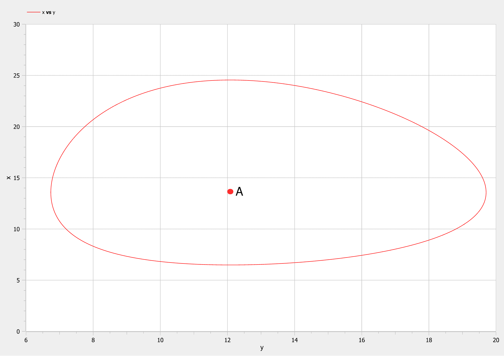
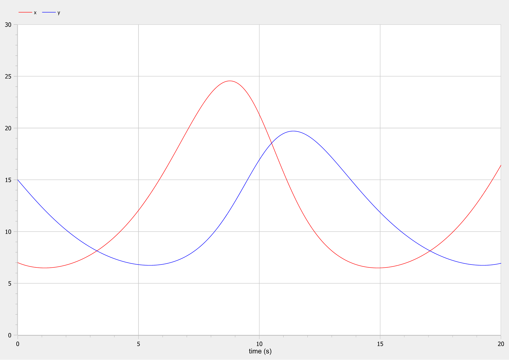

<style>
section::after {
  content: attr(data-marpit-pagination) ' / ' attr(data-marpit-pagination-total);
}
img[alt="center"] {
     display: block;
     margin: 0 auto;
}
h1 {
    font-size: 60px;
    text-align: center;
}
h2 {
    font-size: 30px;
    text-align: left;
    position: relative;
    left: -2em;
    line-height: 0px;
    top: 8em;
}
h3 {
    font-size: 40px;
    text-align: left;
    position: relative;
    left: -0.5em;
    bottom: 0.2em;
}
h4 {
    font-size: 25px;
    text-align: center;
    position: relative;
    left: -0.5em;
    bottom: 0.2em;
}
</style>

# Лабораторная работа №5
## Nikita A. Toponen
## RUDN University, 9 March 2022 Moscow, Russia

--- 

# Модель хищник-жертва

---

### Прагматика выполнения работы

- Знакомство с простейшей моделью взаимодействия двух видов типа «хищник — жертва» - модель Лотки-Вольтерры.

- Визуализация результатов моделирования путем построения фазового портрета и графиков.

---

### Цель выполнения работы

- Научиться строить модели взаимодействия двух видов типа «хищник — жертва» - модели Лотки-Вольтерры.

- Научиться решать систему дифференциальных уравнений и строить фазовые портреты и графики в системе моделирование OpenModelica.

---

### Постановка задачи лабораторной работы 1\2

##### *Вариант 41*
- В лесу проживают $х$ число волков.
- В лесу проживают $y$ число зайцев.
- Пока число зайцев достаточно велико, для прокормки всех волков, численность волков растет до тех пор, пока не наступит момент, что корма перестанет хватать на всех. Тогда волки начнут умирать, и их численность будет уменьшаться.
- В какой-то момент времени численность зайцев снова начнет увеличиваться, что повлечет за собой новый рост популяции волков.
- Такой цикл будет повторяться, пока обе популяции будут существовать. 
- Помимо этого, на численность стаи влияют болезни и старение. 

---

### Постановка задачи лабораторной работы 2\2

Для модели «хищник-жертва»:

​	                                                      $\begin{cases} \frac{dx}{dt} = -0.58x(t) + 0.048x(t)y(t) \\ \frac{dy}{dt} = 0.38y(t) - 0.028x(t)y(t)\end{cases}$

Постройте график зависимости численности хищников от численности жертв, а также графики изменения численности хищников и численности жертв при следующих начальных условиях: $x_0 = 7, y_0 = 15$. Найдите стационарное состояние системы.

---

# Выполнение работы

---

### Анализ кода модели
``` matlab
model lab05

constant Real a=0.58"значение коеффициента a";
constant Real b=0.048"значение коеффициента b";
constant Real c=0.38"значение коеффициента c";
constant Real d=0.028"значение коеффициента d";

Real x"переменная с количеством хищников";
Real y"переменная с количеством жертв";

initial equation
x=7"начальное количество хищников";
y=15"начальное количество жертв";

equation
der(x)=a*x-b*x*y"первое уравнение системы";
der(y)=-c*y+d*x*y"второе уравнение системы";

end lab05;
```

---

### Поиск стационарного состояния системы

Стационарное состояние системы (положение равновесия, не зависящее от времени решение) будет в точке: 

$$x_0=\frac{0.38}{0.028}=13.571428571$$
$$y_0=\frac{0.58}{0.048}=12.083333333$$

---

### Результаты выполнения моделирования 1\2


#### Рис.1 Фазовый портрет модели

---

### Результаты выполнения моделирования 2\2


#### Рис.2 Графики изменения числа хищников и жертв

---

# Спасибо за внимание!
