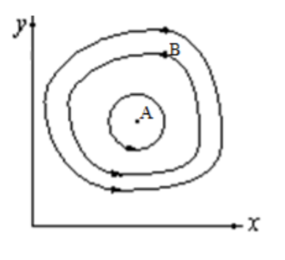
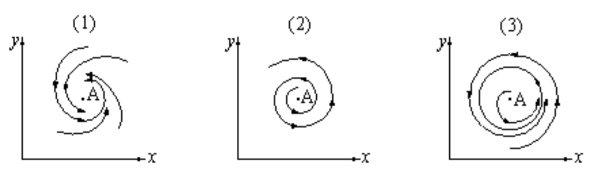
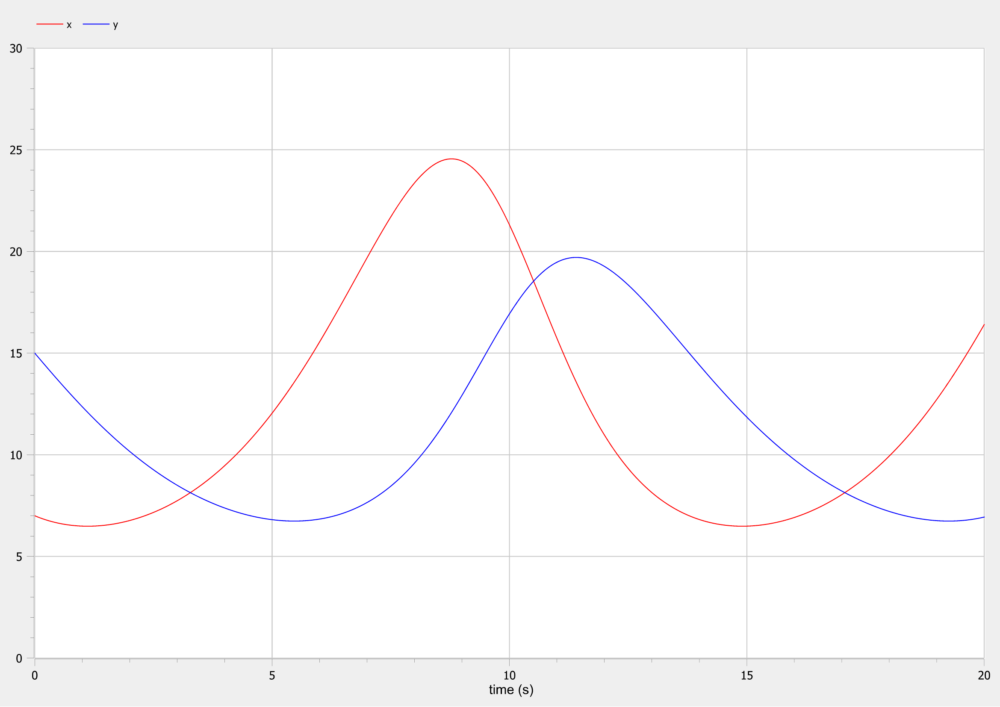

---
# Front matter
title: "Лабораторная работа №5"
subtitle: "Модель хищник-жертва"
author: "Топонен Никита Андреевич"

# Formatting
toc-title: "Содержание"
toc: true # Table of contents
toc_depth: 2
lof: true # List of figures
lot: true # List of tables
fontsize: 12pt
linestretch: 1.5
papersize: a4paper
documentclass: scrreprt
polyglossia-lang: russian
polyglossia-otherlangs: english
mainfont: PT Serif
romanfont: PT Serif
sansfont: PT Sans
monofont: PT Mono
mainfontoptions: Ligatures=TeX
romanfontoptions: Ligatures=TeX
sansfontoptions: Ligatures=TeX,Scale=MatchLowercase
monofontoptions: Scale=MatchLowercase
indent: true
pdf-engine: xelatex
header-includes:
  - \linepenalty=10 # the penalty added to the badness of each line within a paragraph (no associated penalty node) Increasing the value makes tex try to have fewer lines in the paragraph.
  - \interlinepenalty=0 # value of the penalty (node) added after each line of a paragraph.
  - \hyphenpenalty=50 # the penalty for line breaking at an automatically inserted hyphen
  - \exhyphenpenalty=50 # the penalty for line breaking at an explicit hyphen
  - \binoppenalty=700 # the penalty for breaking a line at a binary operator
  - \relpenalty=500 # the penalty for breaking a line at a relation
  - \clubpenalty=150 # extra penalty for breaking after first line of a paragraph
  - \widowpenalty=150 # extra penalty for breaking before last line of a paragraph
  - \displaywidowpenalty=50 # extra penalty for breaking before last line before a display math
  - \brokenpenalty=100 # extra penalty for page breaking after a hyphenated line
  - \predisplaypenalty=10000 # penalty for breaking before a display
  - \postdisplaypenalty=0 # penalty for breaking after a display
  - \floatingpenalty = 20000 # penalty for splitting an insertion (can only be split footnote in standard LaTeX)
  - \raggedbottom # or \flushbottom
  - \usepackage{float} # keep figures where there are in the text
  - \floatplacement{figure}{H} # keep figures where there are in the text
---

# Цель работы

​	Рассмотреть простейшую модель взаимодействия типа "хищник-жертва" - модель **Лотки-Вольтерры**. Написать модель в OpenModelica, построить и проанализировать графики.

# Задание

**Вариант 41**

В лесу проживают $х$ число волков, питающихся зайцами, число которых в этом же лесу $у$. Пока число зайцев достаточно велико, для прокормки всех волков, численность волков растет до тех пор, пока не наступит момент, что корма перестанет хватать на всех. Тогда волки начнут умирать, и их численность будет уменьшаться. В этом случае в какой-то момент времени численность зайцев снова начнет увеличиваться, что повлечет за собой новый рост популяции волков. Такой цикл будет повторяться, пока обе популяции будут существовать. Помимо этого, на численность стаи влияют болезни и старение. 

Для модели «хищник-жертва»:

​	                                                      $$ \begin{cases} \frac{dx}{dt} = -0.58x(t) + 0.048x(t)y(t) \\ \frac{dy}{dt} = 0.38y(t) - 0.028x(t)y(t)\end{cases} $$

Постройте график зависимости численности хищников от численности жертв, а также графики изменения численности хищников и численности жертв при следующих начальных условиях: $x_0 = 7, y_0 = 15$. Найдите стационарное состояние системы.

# Теоретическое введение

Данная двувидовая модель основывается на следующих предположениях: 

1. Численность популяции жертв x и хищников y зависят только от времени (модель не учитывает пространственное распределение популяции на занимаемой территории) 
2. В отсутствии взаимодействия численность видов изменяется по модели Мальтуса, при этом число жертв увеличивается, а число хищников падает 
3. Естественная смертность жертвы и естественная рождаемость хищника считаются несущественными 
4. Эффект насыщения численности обеих популяций не учитывается 
5. Скорость роста численности жертв уменьшается пропорционально численности хищников

​                                                           $$\begin{cases}\frac{dx}{dt} = ax(t) - bx(t)y(t) \\ \frac{dy}{dt} = cx(t) + dx(t)y(t)\end{cases}$$                        $(1)$

В этой модели $x$ – число жертв, $y$ - число хищников. Коэффициент $a$ описывает скорость естественного прироста числа жертв в отсутствие хищников, $с$ - естественное вымирание хищников, лишенных пищи в виде жертв. Вероятность взаимодействия жертвы и хищника считается пропорциональной как количеству жертв, так и числу самих хищников ($xy$). Каждый акт взаимодействия уменьшает популяцию жертв, но способствует увеличению популяции хищников (члены -$bxy$ и $dxy$ в правой части уравнения).

{#fig:1 width=70%}

Математический анализ этой (жесткой) модели показывает, что имеется стационарное состояние ($A$ на рис. 1), всякое же другое начальное состояние ($B$) приводит к периодическому колебанию численности как жертв, так и хищников, так что по прошествии некоторого времени система возвращается в состояние $B$.

Стационарное состояние системы $(1)$ (положение равновесия, не зависящее от времени решение) будет в точке: $$x_0=\frac{c}{d}, y_0=\frac{a}{b}$$. Если начальные значения задать в стационарном состоянии $$x(0)=x_0, y(0)=y_0$$, то в любой момент времени численность популяций изменяться не будет. При малом отклонении от положения равновесия численности как хищника, так и жертвы с течением времени не возвращаются к равновесным значениям, а совершают периодические колебания вокруг стационарной точки. Амплитуда колебаний и их период определяется начальными значениями численностей $x(0), y(0)$. Колебания совершаются в противофазе.

При малом изменении модели

​                                                          $$\begin{cases}\frac{dx}{dt} = ax(t) - bx(t)y(t)+ \epsilon f(x,y)\\ \frac{dy}{dt} = cx(t) + dx(t)y(t) + \epsilon g(x,y), \epsilon<<1\end{cases}$$                         $(2)$

(прибавление к правым частям малые члены, учитывающие, например, конкуренцию жертв за пищу и хищников за жертв), вывод о периодичности (возвращении системы в исходное состояние $B$), справедливый для жесткой системы Лотки-Вольтерры, теряет силу. Таким образом, мы получаем так называемую мягкую модель «хищник-жертва». В зависимости от вида малых поправок $f$ и $g$ возможны следующие сценарии 1-3 (рис. 2)

{#fig:2 width=70%}

В случае 1 равновесное состояние $A$ устойчиво. При любых других начальных условиях через большое время устанавливается именно оно. 

В случае 2 система стационарное состояние неустойчиво. Эволюция приводит то к резкому увеличению числа хищников, то к их почти полному вымиранию. Такая система в конце концов попадает в область столь больших или столь малых значений $x$ и $y$, что модель перестает быть применимой. 

В случае 3 в системе с неустойчивым стационарным состоянием $A$ с течением времени устанавливается периодический режим. В отличие от исходной жесткой модели Лотки-Вольтерры, в этой модели установившийся периодический режим не зависит от начального условия. Первоначально незначительное отклонение от стационарного состояния $A$ приводит не к малым колебаниям около $A$, как в модели Лотки-Вольтерры, а к колебаниям вполне определенной (и не зависящей от малости отклонения) амплитуды. Возможны и другие структурно устойчивые сценарии (например, с несколькими периодическими режимами). 

*Вывод: жесткую модель всегда надлежит исследовать на структурную устойчивость полученных при ее изучении результатов по отношению к малым изменениям модели (делающим ее мягкой).* 

В случае модели Лотки-Вольтерры для суждения о том, какой же из сценариев 1-3 (или иных возможных) реализуется в данной системе, совершенно необходима дополнительная информация о системе (о виде малых поправок $f$ и $g$ в нашей формуле). Математическая теория мягких моделей указывает, какую именно информацию для этого нужно иметь. Без этой информации жесткая модель может привести к качественно ошибочным предсказаниям. Доверять выводам, сделанным на основании жесткой модели, можно лишь тогда, когда они подтверждаются исследованием их структурной устойчивости

# Выполнение лабораторной работы

## Поиск стационарного состояния системы

Стационарное состояние системы (положение равновесия, не зависящее от времени решение) будет в точке: 

1. $$x_0=\frac{0.38}{0.028}=13.571428571$$ 
2. $$y_0=\frac{0.58}{0.048}=12.083333333$$

## Моделирование и построение графиков

Код программы с комментариями:

```matlab
model lab05

constant Real a=0.58"значение коеффициента a";
constant Real b=0.048"значение коеффициента b";
constant Real c=0.38"значение коеффициента c";
constant Real d=0.028"значение коеффициента d";

Real x"переменная с количеством хищников";
Real y"переменная с количеством жертв";

initial equation
x=7"начальное количество хищников";
y=15"начальное количество жертв";

equation
der(x)=a*x-b*x*y"первое уравнение системы";
der(y)=-c*y+d*x*y"второе уравнение системы";

end lab05;
```

Фазовый портрет системы  (рис. 3):

{#fig:3}

{#fig:4}

# Выводы

Благодаря данной лабораторной работе познакомился с простейшей моделью взаимодействия двух видов типа "хищник-жертва" - моделью **Лотки-Вольтерры**, а именно научился:

- строить модель "хищник-жертва" в OpenModelica
- строить фазовые портреты системы "хищник-жертва"
- находить стационарное состояние системы "хищник-жертва"


# Список литературы

- <code>[Кулябов Д.С. *Лабораторная работа №5*](https://esystem.rudn.ru/pluginfile.php/1343813/mod_resource/content/2/Лабораторная%20работа%20№%204.pdf)</code>
- <code>[Кулябов Д.С. *Задания к лабораторной работе №5 ( по вариантам )*](https://esystem.rudn.ru/pluginfile.php/1343814/mod_resource/content/2/Задание%20к%20Лабораторной%20работе%20№%203%20%281%29.pdf)</code>