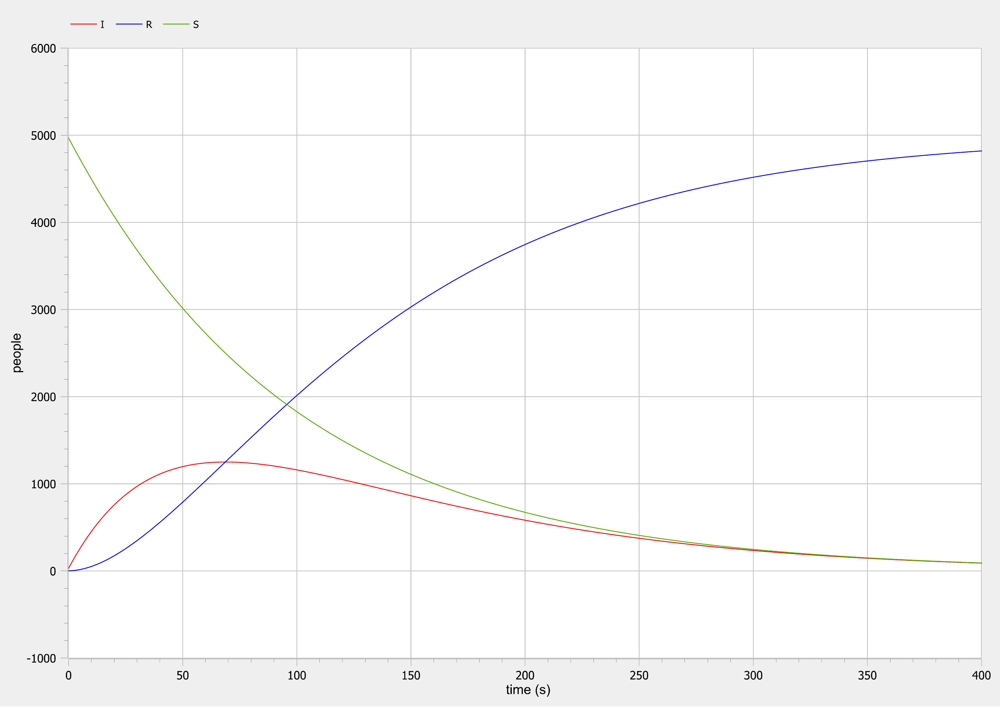

<style>
section::after {
  content: attr(data-marpit-pagination) ' / ' attr(data-marpit-pagination-total);
}
img[alt="center"] {
     display: block;
     margin: 0 auto;
}
h1 {
    font-size: 60px;
    text-align: center;
}
h2 {
    font-size: 30px;
    text-align: left;
    position: relative;
    left: -2em;
    line-height: 0px;
    top: 8em;
}
h3 {
    font-size: 40px;
    text-align: left;
    position: relative;
    left: -0.5em;
    bottom: 0.2em;
}
h4 {
    font-size: 25px;
    text-align: center;
    position: relative;
    left: -0.5em;
    bottom: 0.2em;
}
</style>

# Лабораторная работа №6
## Nikita A. Toponen
## RUDN University, 15 March 2022 Moscow, Russia

--- 

# Задача об эпидемии

---

### Прагматика выполнения работы

- Знакомство с простейшей моделью эпидемии.

- Визуализация результатов моделирования путем построения и анализа графиков.

---

### Цель выполнения работы

- Научиться строить модели эпидемии двух случаев: при наличии новых заразившихся и без них.

- Научиться решать систему дифференциальных уравнений и строить графики в системе моделирование OpenModelica.

---

### Постановка задачи лабораторной работы 1\2

##### *Вариант 41*

- На одном острове вспыхнула эпидемия. Известно, что из всех проживающих на острове ($N=5 000$) 
- В момент начала эпидемии ($t=0$) число заболевших людей (являющихся распространителями инфекции) $I(0)=30$. 
- А число здоровых людей с иммунитетом к болезни $R(0)=1$.
- Таким образом, число людей восприимчивых к болезни, но пока здоровых, в начальный момент времени $S(0)=N-I(0)- R(0)=4969$.

---

### Постановка задачи лабораторной работы 2\2

Постройте графики изменения числа особей в каждой из трех групп. Рассмотрите, как будет протекать эпидемия в случае:

1. если $I(0) > I^*$
2. если $I(0) \leqslant I^*$

---

# Выполнение работы

---

### Код модели для первого случая
``` matlab
model lab06_case1

constant Real alpha=0.01 "коэффициент alpha";
constant Real beta=0.02 "коэффициент beta";

Real S "переменная с количеством восприимчивых к болезни, но пока здоровых";
Real I "переменная с количеством инфецированных распространителей";
Real R "переменная с количеством здоровых с иммунитетом";

initial equation
I=30 "начальное количество инфецированных распространителей";
R=1 "начальное количество здоровых с иммунитетом";
S=4969 "начальное количество восприимчивых к болезни, но пока здоровых";

equation
der(S)=-alpha*S "изменение числа восприимчивых к болезни, но пока здоровых";
der(I)=alpha*S-beta*I "изменение числа инфецированных распространителей";
der(R)=beta*I "изменение числа здоровых с иммунитетом";

end lab06_case1;
```

---

### Графики для первого случая


#### Рис.1 Графики для первого случая

---

### Код модели для второго случая

``` matlab
model lab06_case2

constant Real beta=0.02 "коэффициент beta";

Real S "переменная с количеством восприимчивых к болезни, но пока здоровых";
Real I "переменная с количеством инфецированных распространителей";
Real R "переменная с количеством здоровых с иммунитетом";

initial equation
I=30 "начальное количество инфецированных распространителей";
R=1 "начальное количество здоровых с иммунитетом";
S=4969 "начальное количество восприимчивых к болезни, но пока здоровых";

equation
der(S)=0 "число восприимчивых к болезни, но пока здоровых не меняется";
der(I)=-beta*I "изменение числа инфецированных распространителей";
der(R)=beta*I "изменение числа здоровых с иммунитетом";

end lab06_case2;
```

---

### Графики для второго случая

 и I(t) для второго случая")
#### Рис.2 Графики R(t) и I(t) для второго случая


---

### Графики для второго случая

, I(t) и S(t) для второго случая")
#### Рис.3 Графики R(t),I(t) и S(t) для второго случая

---

# Спасибо за внимание!
