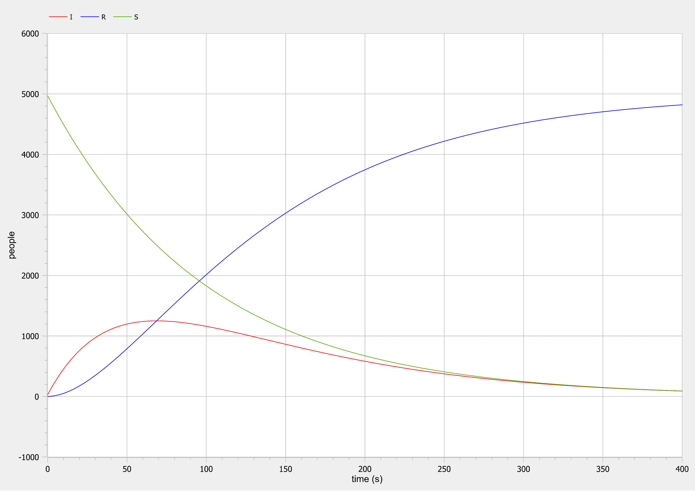
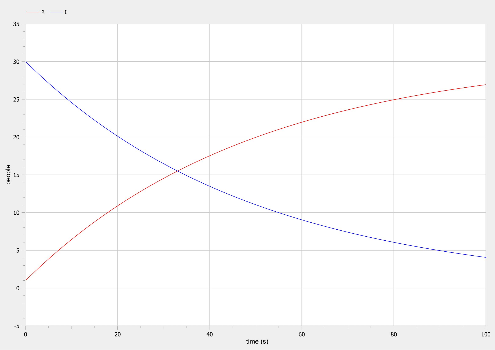
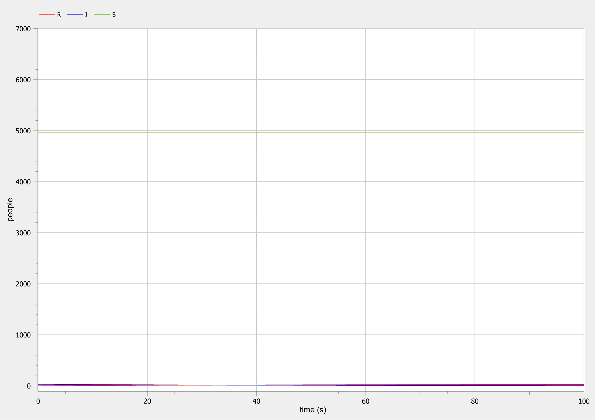

---
# Front matter
title: "Лабораторная работа №6"
subtitle: "Задача об эпидемии"
author: "Топонен Никита Андреевич"

# Formatting
toc-title: "Содержание"
toc: true # Table of contents
toc_depth: 2
lof: true # List of figures
lot: true # List of tables
fontsize: 12pt
linestretch: 1.5
papersize: a4paper
documentclass: scrreprt
polyglossia-lang: russian
polyglossia-otherlangs: english
mainfont: PT Serif
romanfont: PT Serif
sansfont: PT Sans
monofont: PT Mono
mainfontoptions: Ligatures=TeX
romanfontoptions: Ligatures=TeX
sansfontoptions: Ligatures=TeX,Scale=MatchLowercase
monofontoptions: Scale=MatchLowercase
indent: true
pdf-engine: xelatex
header-includes:
  - \linepenalty=10 # the penalty added to the badness of each line within a paragraph (no associated penalty node) Increasing the value makes tex try to have fewer lines in the paragraph.
  - \interlinepenalty=0 # value of the penalty (node) added after each line of a paragraph.
  - \hyphenpenalty=50 # the penalty for line breaking at an automatically inserted hyphen
  - \exhyphenpenalty=50 # the penalty for line breaking at an explicit hyphen
  - \binoppenalty=700 # the penalty for breaking a line at a binary operator
  - \relpenalty=500 # the penalty for breaking a line at a relation
  - \clubpenalty=150 # extra penalty for breaking after first line of a paragraph
  - \widowpenalty=150 # extra penalty for breaking before last line of a paragraph
  - \displaywidowpenalty=50 # extra penalty for breaking before last line before a display math
  - \brokenpenalty=100 # extra penalty for page breaking after a hyphenated line
  - \predisplaypenalty=10000 # penalty for breaking before a display
  - \postdisplaypenalty=0 # penalty for breaking after a display
  - \floatingpenalty = 20000 # penalty for splitting an insertion (can only be split footnote in standard LaTeX)
  - \raggedbottom # or \flushbottom
  - \usepackage{float} # keep figures where there are in the text
  - \floatplacement{figure}{H} # keep figures where there are in the text
---

# Цель работы

​	Рассмотреть простейшую модель эпидемии. Написать модель в OpenModelica, построить и проанализировать графики количества еще не болевших, заболевших, выздоровевших и имеющих иммунитет.

# Задание

**Вариант 41**

​	На одном острове вспыхнула эпидемия. Известно, что из всех проживающих на острове ($N=5 000$) в момент начала эпидемии ($t=0$) число заболевших людей (являющихся распространителями инфекции) $I(0)=30$. А число здоровых людей с иммунитетом к болезни $R(0)=1$. Таким образом, число людей восприимчивых к болезни, но пока здоровых, в начальный момент времени $S(0)=N-I(0)- R(0)=4969$. Постройте графики изменения числа особей в каждой из трех групп. Рассмотрите, как будет протекать эпидемия в случае:

1. если $I(0) > I^*$
2. если $I(0) \leqslant I^*$

# Теоретическое введение

​	Рассмотрим простейшую модель эпидемии. Предположим, что некая популяция, состоящая из $N$ особей, (считаем, что популяция изолирована) подразделяется на три группы. 

1. Первая группа - это восприимчивые к болезни, но пока здоровые особи, обозначим их через $S(t)$. 
2. Вторая группа – это число инфицированных особей, которые также при этом являются распространителями инфекции, обозначим их $I(t)$. 
3. А третья группа, обозначающаяся через $R(t)$ – это здоровые особи с иммунитетом к болезни.

​	До того, как число заболевших не превышает критического значения $I^*$ , считаем, что все больные изолированы и не заражают здоровых. Когда $I(t)>I^*$ , тогда инфицирование способны заражать восприимчивых к болезни особей. 

​	Таким образом, скорость изменения числа $S(t)$ меняется по следующему закону:

$\frac{dS}{dt}=\begin{cases} -\alpha*S,\ если\ I(0)>I^* \\ 0,\ если\ I(t) \leq I^* \end{cases}$         $(1)$

​	Поскольку каждая восприимчивая к болезни особь, которая, в конце концов, заболевает, сама становится инфекционной, то скорость изменения числа инфекционных особей представляет разность за единицу времени между заразившимися и теми, кто уже болеет и лечится, т.е.:

$\frac{dI}{dt}=\begin{cases} \alpha*S - \beta*I,\ если\ I(0)>I^* \\ -\beta*I,\ если\ I(t) \leq I^* \end{cases}$        $(2)$

​	А скорость изменения выздоравливающих особей (при этом приобретающие иммунитет к болезни):

$\frac{dR}{dt}=\beta*I$     $(3)$

​	Постоянные пропорциональности $\alpha$, $\beta$ - это коэффициенты заболеваемости и выздоровления соответственно.

​	Для того, чтобы решения соответствующих уравнений определялось однозначно, необходимо задать начальные условия .Считаем, что на начало эпидемии в момент времени $t(0)$ особей с иммунитетом к болезни $R(0)=1$, а число инфицированных и восприимчивых к болезни особей $I(0)=30$ и $S(0)=4969$ соответственно. Для анализа картины протекания эпидемии необходимо рассмотреть два случая: $I(0)>I^*$ и $I(0) \leq I^*$

# Выполнение лабораторной работы

## Случай первый: $I(0)>I^*$

​	В этом случае значения $S(t),\ I(t),\ R(t)$ изменяются по следующим законам:

1. Из $(1) => \frac{dS}{dt}=-\alpha*S$
2. Из $(2) => \frac{dI}{dt}=\alpha*S - \beta*I$
3. $\frac{dR}{dt}=\beta*I$ 

​	Код модели для первого случая:

```matlab
model lab06_case1

constant Real alpha=0.01 "коэффициент alpha";
constant Real beta=0.02 "коэффициент beta";

Real S "переменная с количеством восприимчивых к болезни, но пока здоровых";
Real I "переменная с количеством инфецированных распространителей";
Real R "переменная с количеством здоровых с иммунитетом";

initial equation
I=30 "начальное количество инфецированных распространителей";
R=1 "начальное количество здоровых с иммунитетом";
S=4969 "начальное количество восприимчивых к болезни, но пока здоровых";

equation
der(S)=-alpha*S "изменение числа восприимчивых к болезни, но пока здоровых";
der(I)=alpha*S-beta*I "изменение числа инфецированных распространителей";
der(R)=beta*I "изменение числа здоровых с иммунитетом";

end lab06_case1;
```


{#fig:001}

## Случай второй: $I(t) \leq I^*$

В этом случае значения $S(t),\ I(t),\ R(t)$ изменяются по следующим законам:

1. Из $(1) => \frac{dS}{dt}=0$
2. Из $(2) => \frac{dI}{dt}=-\beta*I$
3. $\frac{dR}{dt}=\beta*I$ 

​	Код модели для второго случая:

```matlab
model lab06_case2

constant Real beta=0.02 "коэффициент beta";

Real S "переменная с количеством восприимчивых к болезни, но пока здоровых";
Real I "переменная с количеством инфецированных распространителей";
Real R "переменная с количеством здоровых с иммунитетом";

initial equation
I=30 "начальное количество инфецированных распространителей";
R=1 "начальное количество здоровых с иммунитетом";
S=4969 "начальное количество восприимчивых к болезни, но пока здоровых";

equation
der(S)=0 "число восприимчивых к болезни, но пока здоровых не меняется";
der(I)=-beta*I "изменение числа инфецированных распространителей";
der(R)=beta*I "изменение числа здоровых с иммунитетом";

end lab06_case2;
```

{#fig:002}

{#fig:003}

# Выводы

​	В первом случае видно, что количество болеющих сначала резко растет, но затем плавно снижается к нулю вместе с количеством еще не болевших особей, так как все они обретают иммунитет после того как переболели, что видно по синему графику, который плавно растет и неизбежно станет равным $N$.

​	Во втором случае так как инфицированные особи никого не заражают, то число людей не болевших не изменяется и остается на планке в 4969, а инфицированные постепенно переходят в разряд переболевших с иммунитетом, что видно на графике (@fig002).


# Список литературы

- <code>[Кулябов Д.С. *Лабораторная работа №6*](https://esystem.rudn.ru/pluginfile.php/1343817/mod_resource/content/2/Лабораторная%20работа%20№%205.pdf)</code>
- <code>[Кулябов Д.С. *Задания к лабораторной работе №6 ( по вариантам )*](https://esystem.rudn.ru/pluginfile.php/1343818/mod_resource/content/2/Задание%20к%20лабораторной%20работе%20№%207%20%283%29.pdf)</code>