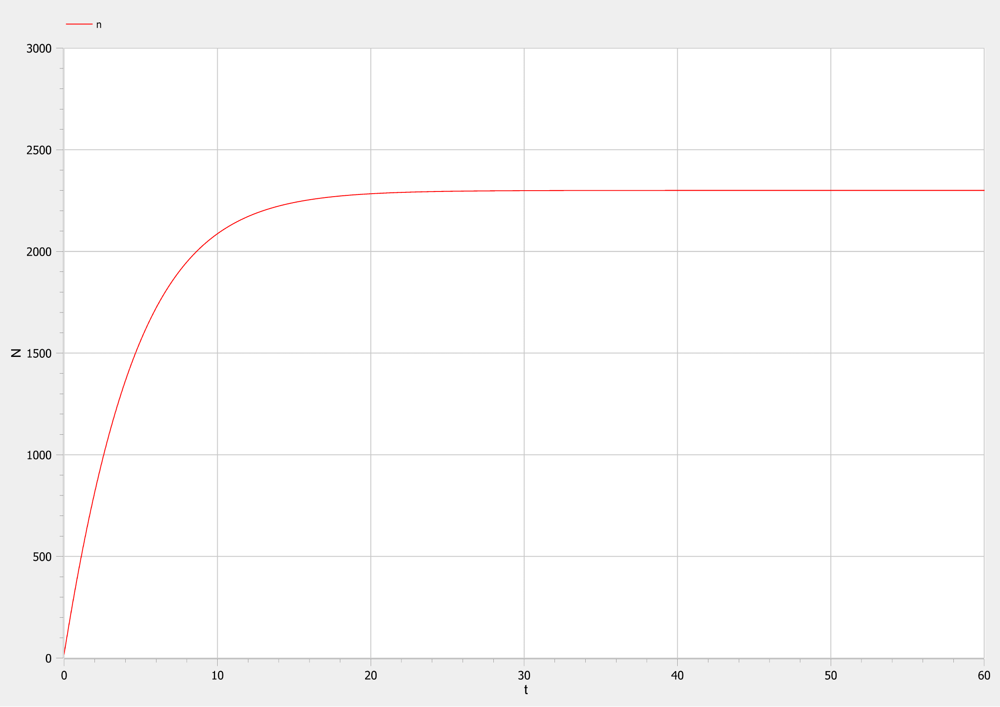
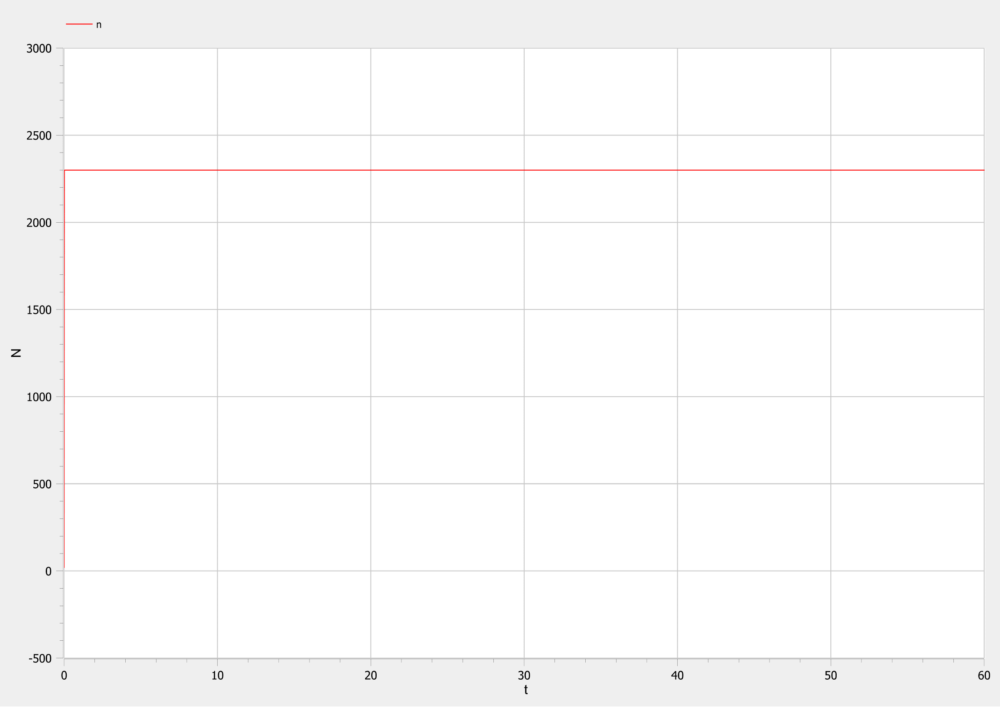
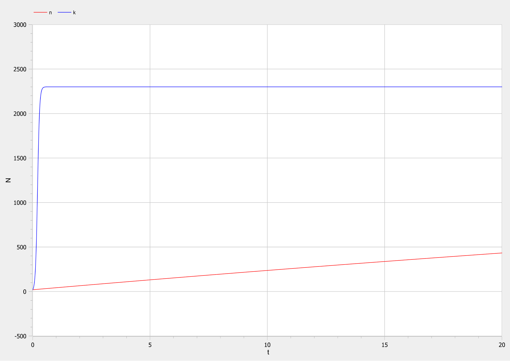

<style>
section::after {
  content: attr(data-marpit-pagination) ' / ' attr(data-marpit-pagination-total);
}
img[alt="center"] {
     display: block;
     margin: 0 auto;
}
h1 {
    font-size: 60px;
    text-align: center;
}
h2 {
    font-size: 30px;
    text-align: left;
    position: relative;
    left: -2em;
    line-height: 0px;
    top: 8em;
}
h3 {
    font-size: 40px;
    text-align: left;
    position: relative;
    left: -0.5em;
    bottom: 0.2em;
}
h4 {
    font-size: 25px;
    text-align: center;
    position: relative;
    left: -0.5em;
    bottom: 0.2em;
}
</style>

# Лабораторная работа №7
## Nikita A. Toponen
## RUDN University, 22 March 2022 Moscow, Russia

--- 

# Модель эффективности рекламы

---

### Прагматика выполнения работы

- Знакомство с простейшей моделью эффективности рекламы.

- Визуализация результатов моделирования путем построения и анализа графиков.

---

### Цель выполнения работы

- Научиться строить модели эффективности рекламы трех случаев:
    1. При высокой эффективности рекламы
    2. При высокой эффективности сарафанного радио
    3. При равных эффективностях рекламы и сарафанного радио

- Научиться решать дифференциальное уравнение и строить графики в системе моделирование OpenModelica.

---

### Постановка задачи лабораторной работы 1\2

##### *Вариант 41*

Постройте график распространения рекламы, математическая модель которой описывается следующим уравнением:

1. $$\frac{dn}{dt}=(0.205+0.000023*n(t))*(N-n(t))$$
2. $$\frac{dn}{dt}=(0.0000305+0.24*n(t))*(N-n(t))$$
3. $$\frac{dn}{dt}=(0.05*sin(t)+0.03*cos(4t)*n(t))*(N-n(t))$$

---

### Постановка задачи лабораторной работы 2\2

При этом объем аудитории $N=2300$ , в начальный момент о товаре знает $n(0)=20$ человек. Для случая 2 определите в какой момент времени скорость распространения рекламы будет иметь максимальное значение.

---

# Выполнение работы

---

### Код модели для первого случая
``` matlab
model lab07_case1

constant Real alpha_1=0.205 "значение коэффициента aplha_1";
constant Real alpha_2=0.000023 "значение коэффициента aplha_2";
constant Real N=2300 "объем аудитории";

Real n "число людей снающих о товаре";

initial equation
n=20 "количество людей, знающий о товаре в момент времени t=0";

equation
der(n)=(alpha_1+alpha_2*n)*(N-n);

end lab07_case1;
```

---

### График для первого случая


#### Рис.1 График для первого случая

---

### Код модели для второго случая

``` matlab
model lab07_case2

constant Real alpha_1=0.0000305 "значение коэффициента aplha_1";
constant Real alpha_2=0.24 "значение коэффициента aplha_2";
constant Real N=2300 "объем аудитории";

Real n "число людей снающих о товаре";

initial equation
n=20 "количество людей, знающий о товаре в момент времени t=0";

equation
der(n)=(alpha_1+alpha_2*n)*(N-n);

end lab07_case2;
```

---

### График для второго случая


#### Рис.2 График для второго случая


---

### Код модели для третьего случая

``` matlab
model lab07_case3

constant Real N=2300 "объем аудитории";

Real n "число людей снающих о товаре";
Real alpha_1 "значение коэффициента aplha_1";
Real alpha_2 "значение коэффициента aplha_2";

initial equation
n=20 "количество людей, знающий о товаре в момент времени t=0";
alpha_1=0 "начальное значение коэффициента alpha_1";
alpha_2=0.03 "начальное значение коэффициента alpha_2";

equation
alpha_1=abs(0.05*sin(time));
alpha_2=abs(0.03*cos(4*time));
der(n)=(alpha_1+alpha_2*n)*(N-n);

end lab07_case3;
```

---

### График для третьего случая


#### Рис.3 График для третьего случая

---

### Сравнение эффективности


#### Рис.4 Сравнение эффективности рекламы и сарафанного радио
---

# Спасибо за внимание!
