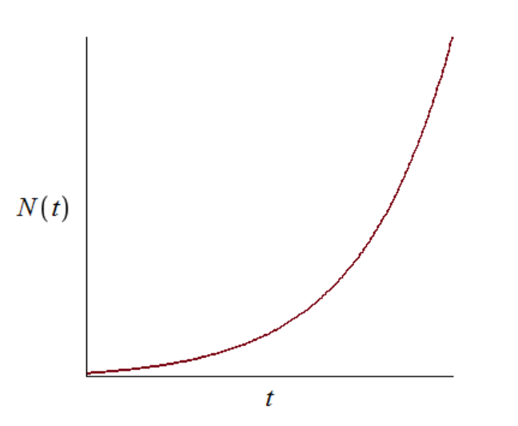
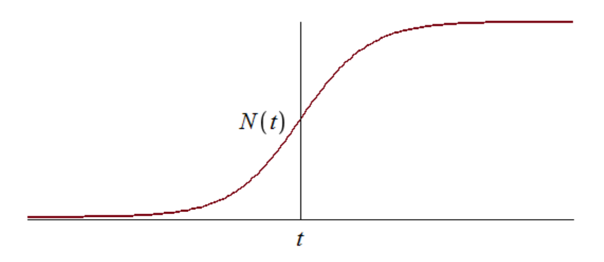
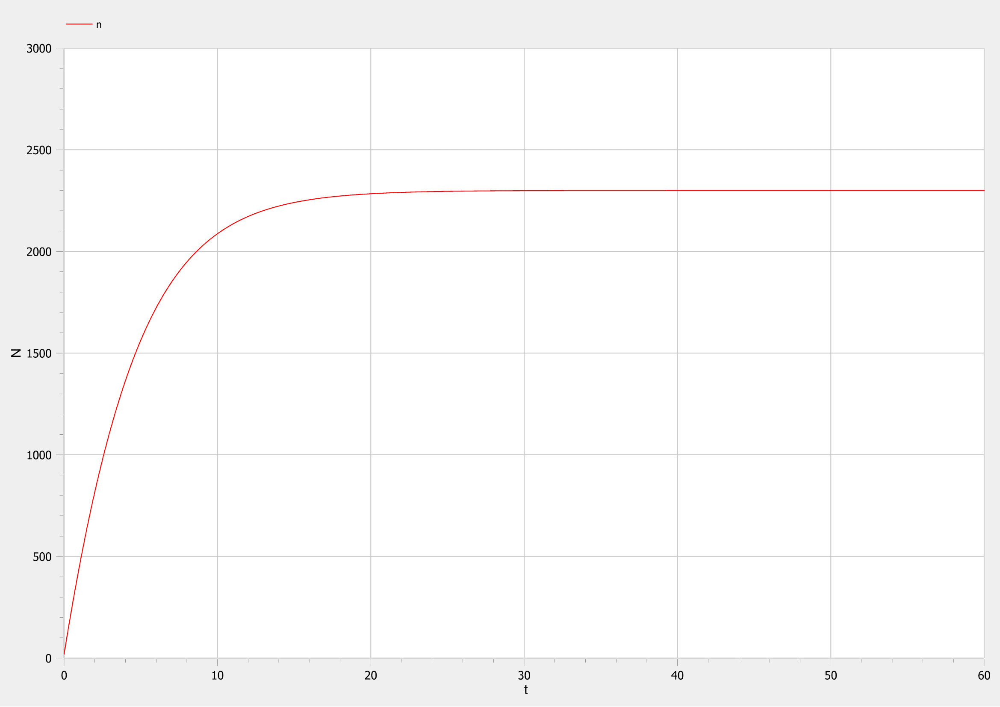
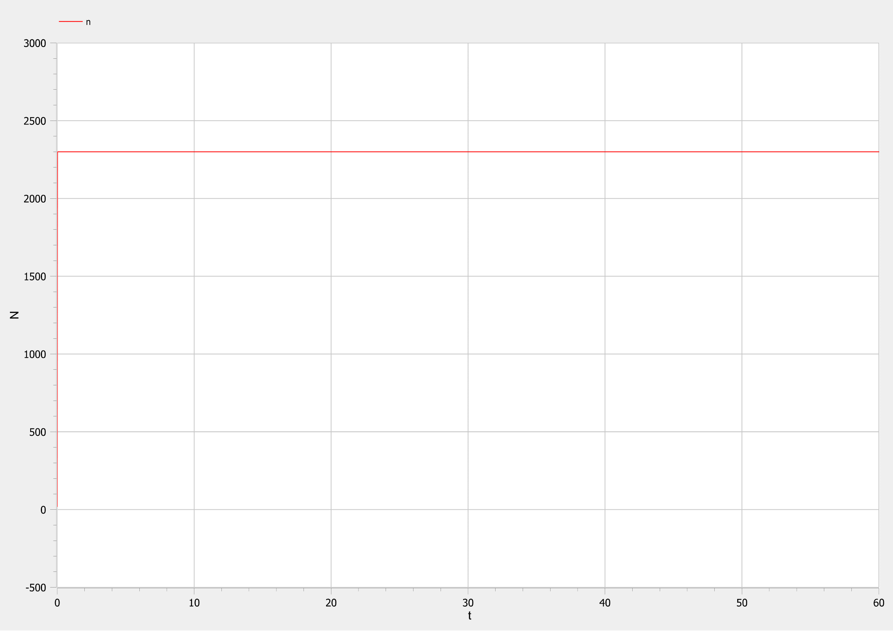
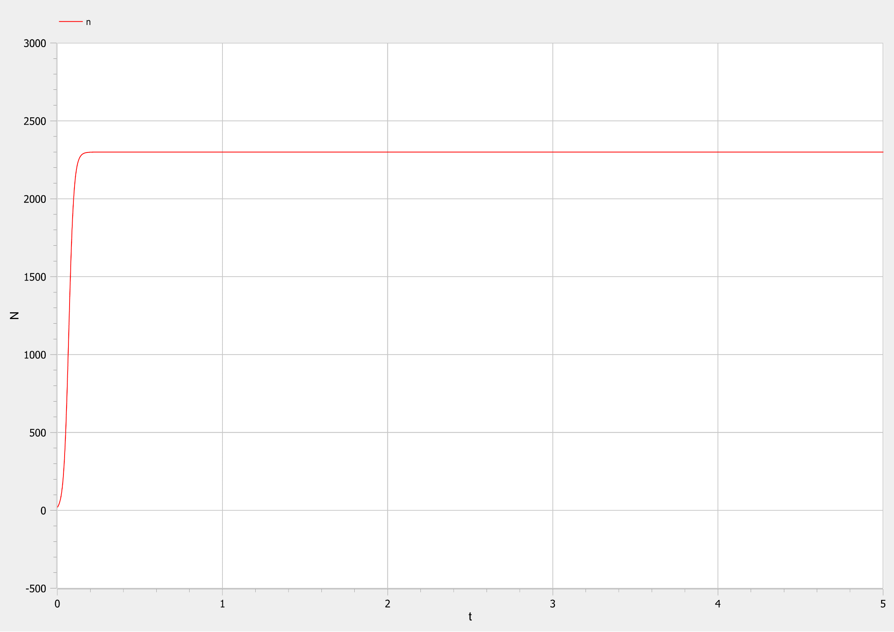
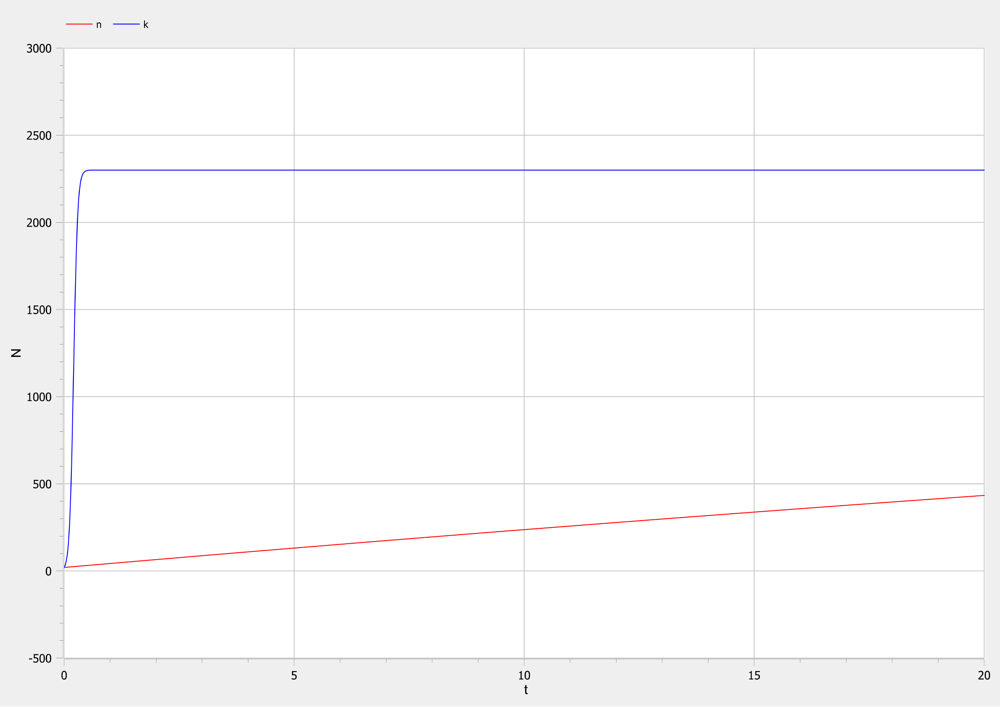

---
# Front matter
lang: ru-Ru
title: "Лабораторная работа №7"
subtitle: "Эффективность рекламы"
author: "Топонен Никита Андреевич"

# Formatting
toc-title: "Содержание"
toc: true # Table of contents
toc_depth: 2
lof: true # List of figures
lot: true # List of tables
fontsize: 12pt
linestretch: 1.5
papersize: a4paper
documentclass: scrreprt
polyglossia-lang: russian
polyglossia-otherlangs: english
mainfont: PT Serif
romanfont: PT Serif
sansfont: PT Sans
monofont: PT Mono
mainfontoptions: Ligatures=TeX
romanfontoptions: Ligatures=TeX
sansfontoptions: Ligatures=TeX,Scale=MatchLowercase
monofontoptions: Scale=MatchLowercase
indent: true
pdf-engine: xelatex
header-includes:
  - \linepenalty=10 # the penalty added to the badness of each line within a paragraph (no associated penalty node) Increasing the value makes tex try to have fewer lines in the paragraph.
  - \interlinepenalty=0 # value of the penalty (node) added after each line of a paragraph.
  - \hyphenpenalty=50 # the penalty for line breaking at an automatically inserted hyphen
  - \exhyphenpenalty=50 # the penalty for line breaking at an explicit hyphen
  - \binoppenalty=700 # the penalty for breaking a line at a binary operator
  - \relpenalty=500 # the penalty for breaking a line at a relation
  - \clubpenalty=150 # extra penalty for breaking after first line of a paragraph
  - \widowpenalty=150 # extra penalty for breaking before last line of a paragraph
  - \displaywidowpenalty=50 # extra penalty for breaking before last line before a display math
  - \brokenpenalty=100 # extra penalty for page breaking after a hyphenated line
  - \predisplaypenalty=10000 # penalty for breaking before a display
  - \postdisplaypenalty=0 # penalty for breaking after a display
  - \floatingpenalty = 20000 # penalty for splitting an insertion (can only be split footnote in standard LaTeX)
  - \raggedbottom # or \flushbottom
  - \usepackage{float} # keep figures where there are in the text
  - \floatplacement{figure}{H} # keep figures where there are in the text
---

# Цель работы

​	Рассмотреть модель эффективности рекламы. Написать модель в OpenModelica, построить и проанализировать графики эффективности рекламы для трех случаев.

# Задание

**Вариант 41**

​	Постройте график распространения рекламы, математическая модель которой описывается следующим уравнением:

1. $$\frac{dn}{dt}=(0.205+0.000023*n(t))*(N-n(t))$$
2. $$\frac{dn}{dt}=(0.0000305+0.24*n(t))*(N-n(t))$$
3. $$\frac{dn}{dt}=(0.05*sin(t)+0.03*cos(4t)*n(t))*(N-n(t))$$

При этом объем аудитории $N=2300$ , в начальный момент о товаре знает $n(0)=20$ человек. Для случая 2 определите в какой момент времени скорость распространения рекламы будет иметь максимальное значение.

# Теоретическое введение

​	Организуется рекламная кампания нового товара или услуги. Необходимо, чтобы прибыль будущих продаж с избытком покрывала издержки на рекламу. Вначале расходы могут превышать прибыль, поскольку лишь малая часть потенциальных покупателей будет информирована о новинке. Затем, при увеличении числа продаж, возрастает и прибыль, и, наконец, наступит момент, когда рынок насытиться, и рекламировать товар станет бесполезным.

​	Предположим, что торговыми учреждениями реализуется некоторая продукция, о которой в момент времени $t$ из числа потенциальных покупателей $N$ знает лишь n покупателей. Для ускорения сбыта продукции запускается реклама по радио, телевидению и других средств массовой информации. После запуска рекламной кампании информация о продукции начнет распространяться среди потенциальных покупателей путем общения друг с другом. Таким образом, после запуска рекламных объявлений скорость изменения числа знающих о продукции людей пропорциональна как числу знающих о товаре покупателей, так и числу покупателей о нем не знающих.

​	Модель рекламной кампании описывается следующими величинами. Считаем, что $\frac{dn}{dt}$ - скорость изменения со временем числа потребителей, узнавших о товаре и готовых его купить, $t$ - время, прошедшее с начала рекламной кампании, $n(t)$ - число уже информированных клиентов. Эта величина пропорциональна числу покупателей, еще не знающих о нем, это описывается следующим образом: $\alpha_1(t)*(N-n(t))$, где $N$ - общее число потенциальных платежеспособных покупателей, $\alpha_1(t)>0$ - характеризует интенсивность рекламной кампании (зависит от затрат на рекламу в данный момент времени). Помимо этого, узнавшие о товаре потребители также распространяют полученную информацию среди потенциальных покупателей, не знающих о нем (в этом случае работает т.н. сарафанное радио). Этот вклад в рекламу описывается величиной $\alpha_2(t)*(N-n(t))$ , эта величина увеличивается с увеличением потребителей узнавших о товаре. Математическая модель распространения рекламы описывается уравнением:

​                                                $$\frac{dn}{dt}=(\alpha_1(t)+\alpha_2(t)*n(t))*(N-n(t))$$        $(1)$

​	При $\alpha_1(t) >> \alpha_2(t)$ получается модель типа модели Мальтуса, решение которой имеет вид (@001)

{#fig:001}

​	В обратном случае, при $\alpha_1(t) << \alpha_2(t)$ получаем уравнение логистической кривой (@002):

{#fig:002}

# Выполнение лабораторной работы

## Случай первый: $\alpha_1(t) >> \alpha_2(t)$

​	В этом случае уравнение принимает следующий вид:

$$\frac{dn}{dt}=(0.205+0.000023*n(t))*(N-n(t))$$

С начальными значениями $N=2300$, $n=20$.

​	Код модели для первого случая:

```matlab
model lab07_case1

constant Real alpha_1=0.205 "значение коэффициента aplha_1";
constant Real alpha_2=0.000023 "значение коэффициента aplha_2";
constant Real N=2300 "объем аудитории";

Real n "число людей снающих о товаре";

initial equation
n=20 "количество людей, знающий о товаре в момент времени t=0";

equation
der(n)=(alpha_1+alpha_2*n)*(N-n);

end lab07_case1;
```


{#fig:003}

## Случай второй: $\alpha_1(t) << \alpha_2(t)$

В этом случае уравнение принимает следующий вид:

$$\frac{dn}{dt}=(0.0000305+0.24*n(t))*(N-n(t))$$

С начальными значениями $N=2300$, $n=20$.

​	Код модели для второго случая:

```matlab
model lab07_case2

constant Real alpha_1=0.0000305 "значение коэффициента aplha_1";
constant Real alpha_2=0.24 "значение коэффициента aplha_2";
constant Real N=2300 "объем аудитории";

Real n "число людей снающих о товаре";

initial equation
n=20 "количество людей, знающий о товаре в момент времени t=0";

equation
der(n)=(alpha_1+alpha_2*n)*(N-n);

end lab07_case2;
```

{#fig:004}

Как видно из графика скорость распространения рекламы имеет максимальное значение с ростом количества узнавших о продукте людей, так как в данном случае, когда коэффициент $\alpha_2$ много больше $\alpha_1$ практически вся реклама распространяется сарафанным радио. То есть чем больше людей знает, тем быстрее распространяется реклама.

## Случай третий: $\alpha_1(t) \approx \alpha_2(t)$

В этом случае уравнение принимает следующий вид:

$$\frac{dn}{dt}=(0.05*sin(t)+0.03*cos(4t)*n(t))*(N-n(t))$$

С начальными значениями $N=2300$, $n=20$.

​	Код модели для третьего случая:

```matlab
model lab07_case3

constant Real N=2300 "объем аудитории";

Real n "число людей снающих о товаре";
Real alpha_1 "значение коэффициента aplha_1";
Real alpha_2 "значение коэффициента aplha_2";

initial equation
n=20 "количество людей, знающий о товаре в момент времени t=0";
alpha_1=0 "начальное значение коэффициента alpha_1";
alpha_2=0.03 "начальное значение коэффициента alpha_2";

equation
alpha_1=abs(0.05*sin(time));
alpha_2=abs(0.03*cos(4*time));
der(n)=(alpha_1+alpha_2*n)*(N-n);

end lab07_case3;
```

{#fig:005}

## Сравнение эффективности

{#fig:006}

На данном графике синяя линия - это эффективность сарафанного радио, а красная - эффективность рекламы.

## Вопросы к лабораторной

### Записать модель Мальтуса (дать пояснение, где используется данная модель)

$$ \frac{\partial N}{\partial t} = rN $$

где

- $N$ — исходная численность населения,
- $r$ — коэффициент пропорциональности, для которого $r = b - d$, где
  - $b$ — коэффициент рождаемости
  - $d$ — коэффициент смертности
- t — время.

Модель используется в экологии для расчета изменения популяции особей животных.

### Записать уравнение логистической кривой (дать пояснение, что описывает данное уравнение)

$$ \frac{\partial P}{\partial t} = rP(1 - \frac{P}{K}) $$

- $r$ — характеризует скорость роста (размножения)
- $K$ — поддерживающая ёмкость среды (то есть, максимально возможная численность популяции)

Исходные предположения для вывода уравнения при рассмотрении популяционной динамики выглядят следующим образом:

- скорость размножения популяции пропорциональна её текущей численности, при прочих равных условиях;
- скорость размножения популяции пропорциональна количеству доступных ресурсов, при прочих равных условиях. Таким образом, второй член уравнения отражает конкуренцию за ресурсы, которая ограничивает рост популяции.

### На что влияет коэффициент $\alpha_1(t)$ и $\alpha_2(t)$ в модели распространения рекламы

$\alpha_1(t)$ — интенсивность рекламной кампании, зависящая от затрат

$\alpha_2(t)$ — интенсивность рекламной кампании, зависящая от сарафанного радио

### Как ведет себя рассматриваемая модель при $\alpha_1(t) \gg \alpha_2(t)$

При $\alpha_1(t) \gg \alpha_2(t)$ получается модель типа модели Мальтуса (@007):

{ #fig:007}

### Как ведет себя рассматриваемая модель при $\alpha_1(t) \ll \alpha_2(t)$

При $\alpha_1(t) \ll \alpha_2(t)$ получаем уравнение логистической кривой (@008):

{ #fig:008}

# Выводы

​	Как видно по графикам трех случаев и сравнения эффективности, в данной модели сарафанное радио работает намного лучше, так как намного больше людей узнает о продукте именно благодаря ему.


# Список литературы

- <code>[Кулябов Д.С. *Лабораторная работа №7*](https://esystem.rudn.ru/pluginfile.php/1343821/mod_resource/content/2/%D0%9B%D0%B0%D0%B1%D0%BE%D1%80%D0%B0%D1%82%D0%BE%D1%80%D0%BD%D0%B0%D1%8F%20%D1%80%D0%B0%D0%B1%D0%BE%D1%82%D0%B0%20%E2%84%96%206.pdf)</code>
- <code>[Кулябов Д.С. *Задания к лабораторной работе №7 ( по вариантам )*](https://esystem.rudn.ru/pluginfile.php/1343822/mod_resource/content/2/%D0%97%D0%B0%D0%B4%D0%B0%D0%BD%D0%B8%D0%B5%20%D0%BA%20%D0%BB%D0%B0%D0%B1%D0%BE%D1%80%D0%B0%D1%82%D0%BE%D1%80%D0%BD%D0%BE%D0%B9%20%D1%80%D0%B0%D0%B1%D0%BE%D1%82%D0%B5%20%E2%84%96%202%20%20%281%29.pdf)</code>