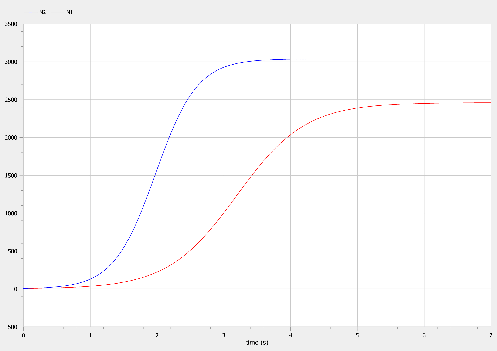
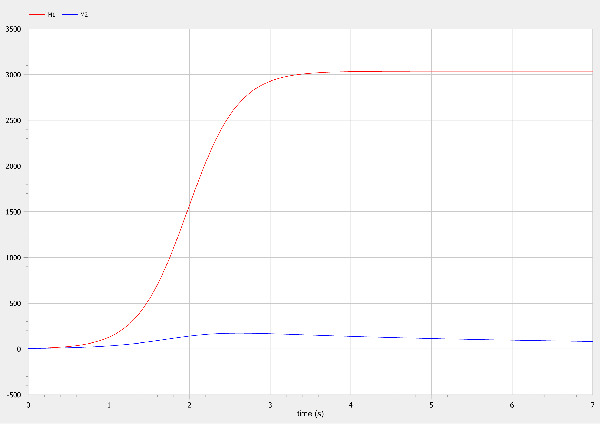

<style>
section::after {
  content: attr(data-marpit-pagination) ' / ' attr(data-marpit-pagination-total);
}
img[alt="center"] {
     display: block;
     margin: 0 auto;
}
h1 {
    font-size: 60px;
    text-align: center;
}
h2 {
    font-size: 30px;
    text-align: left;
    position: relative;
    left: -2em;
    line-height: 0px;
    top: 8em;
}
h3 {
    font-size: 40px;
    text-align: left;
    position: relative;
    left: -0.5em;
    bottom: 0.2em;
}
h4 {
    font-size: 25px;
    text-align: center;
    position: relative;
    left: -0.5em;
    bottom: 0.2em;
}
</style>

# Лабораторная работа №8
## Nikita A. Toponen
## RUDN University, 28 March 2022 Moscow, Russia

--- 

# Модель конкуренции двух фирм

---

### Прагматика выполнения работы

- Знакомство с моделью конкуренции двух фирм в двух случаях.

- Визуализация результатов моделирования путем построения и анализа графиков.

---

### Цель выполнения работы

- Научиться строить модели конкуренции двух фирм двух случаев:
    1. Имеется только экономический фактор влияния
    2. Помимо экономического фактора влияния имеются еще и социально-психологические факторы

- Научиться решать систему дифференциальных уравнений и строить графики в системе моделирование OpenModelica.

---

### Постановка задачи лабораторной работы 1\5

##### *Вариант 41 Случай 1*

Рассмотрим две фирмы, производящие взаимозаменяемые товары одинакового качества и находящиеся в одной рыночной нише. Считаем, что в рамках нашей модели конкурентная борьба ведётся только рыночными методами. То есть, конкуренты могут влиять на противника путем изменения параметров своего производства: себестоимость, время цикла, но не могут прямо вмешиваться в ситуацию на рынке («назначать» цену или влиять на потребителей каким-либо иным способом.) Будем считать, что постоянные издержки пренебрежимо малы, и в модели учитывать не будем. В этом случае динамика изменения объемов продаж фирмы 1 и фирмы 2 описывается следующей системой уравнений:

---

### Постановка задачи лабораторной работы 2\5

$$ \begin{cases} \frac{\partial M_1}{\partial \theta} = M_1 - \frac{b}{c_1} M_1 M_2 - \frac{a_1}{c_1} M_1^2 \\ \frac{\partial M_2}{\partial \theta} = \frac{c_2}{c_1} M_2 -\frac{b}{c_1} M_1 M_2 - \frac{a_2}{c_1} M_2^2 \end{cases} $$

$$ \tag{16} a_1 = \frac{p_{cr}}{\tau_1^2 \tilde{p}_1^2 Nq}, a_2 = \frac{p_{cr}}{\tau_2^2 \tilde{p}_2^2 Nq}, b = \frac{p_{cr}}{\tau_1^2 \tilde{p}_1^2 \tau_2^2 \tilde{p}_2^2 Nq}, c_1 = \frac{p_{cr} - \tilde{p}_1}{\tau_1^2 \tilde{p}_1^2}, c_2 = \frac{p_{cr} - \tilde{p}_2}{\tau_2^2 \tilde{p}_2^2} $$

Также введена нормировка $t=c_1\theta$

---

### Постановка задачи лабораторной работы 3\5

##### *Случай 2*

Рассмотрим модель, когда, помимо экономического фактора влияния (изменение себестоимости, производственного цикла, использование кредита и т.п.), используются еще и социально-психологические факторы – формирование общественного предпочтения одного товара другому, не зависимо от их качества и цены. В этом случае взаимодействие двух фирм будет зависеть друг от друга, соответственно коэффициент перед $M_1M_2$ будет отличаться. Пусть в рамках рассматриваемой модели динамика изменения объемов продаж фирмы 1 и фирмы 2 описывается следующей системой уравнений:

---

### Постановка задачи лабораторной работы 4\5

$$ \begin{cases} \frac{\partial M_1}{\partial \theta} = M_1 - \frac{b}{c_1} M_1 M_2 - \frac{a_1}{c_1} M_1^2 \\ \frac{\partial M_2}{\partial \theta} = \frac{c_2}{c_1} M_2 - (\frac{b}{c_1} + 0.00021)M_1 M_2 - \frac{a_2}{c_1} M_2^2 \end{cases} $$

---

### Постановка задачи лабораторной работы 5\5

- $M_0^1 = 5.5$ — оборотные средства фирмы 1

- $M_0^2 = 5$ — оборотные средства фирмы 2

- $p_{cr} = 35$ — критическая стоимость продукта

- $N = 41$ — число потребителей производимого продукта

- $q = 1$ — максимальная потребность одного человека в продукте в единицу времени

- $\tau_1 = 14$ — длительность производственного цикла фирмы 1

- $\tau_2 = 7$ — длительность производственного цикла фирмы 2

- $\tilde{p}_1 = 6.5$ — себестоимость продукта у фирмы 1

- $\tilde{p}_2 = 15$ — себестоимость продукта у фирмы 2

---

# Выполнение работы

---

### Код модели для первого случая
``` matlab
model lab08_case1

constant Real p_cr = 35 "критическая стоимость продукта";
constant Real N = 41 "число потребителей производимого продукта";
constant Real q = 1 "максимальная потребность одного человека в продукте в единицу времени";
constant Real tau_1 = 14 "длительность производственного цикла фирмы 1";
constant Real tau_2 = 7 "длительность производственного цикла фирмы 2"; 
constant Real p_tilda_1 = 6.5 "себестоимость продукта, то есть переменные издержки на производство единицы продукции фирмы 1";
constant Real p_tilda_2 = 15 "себестоимость продукта, то есть переменные издержки на производство единицы продукции фирмы 2";
constant Real a1 = p_cr/((tau_1^2)*(p_tilda_1^2)*N*q);
constant Real a2 = p_cr/((tau_2^2)*(p_tilda_2^2)*N*q);
constant Real b = p_cr/((tau_1^2)*(p_tilda_1^2)*(tau_2^2)*(p_tilda_2^2)*N*q);
constant Real c1 = (p_cr-p_tilda_1)/(tau_1*p_tilda_1);
constant Real c2 = (p_cr-p_tilda_2)/(tau_2*p_tilda_2);

Real M1 "оборотные средства предприятия 1";
Real M2 "оборотные средства предприятия 2";
Real teta "безразмерное время";
Real stationary_1 "стационарное состояние фирмы 1";
Real stationary_2 "стационарное состояние фирмы 2";

initial equation
M1 = 5.5;
M2 = 5;
teta = 0;

equation
stationary_1 = (c1*a2-b*c2)/(a1*a2-b*b);
stationary_2 = (a1*c2-b*c1)/(a1*a2-b*b);
teta = time/c1;
der(M1)/der(teta)=M1-(b/c1)*M1*M2-(a1/c1)*M1^2;
der(M2)/der(teta)=(c2/c1)*M2-(b/c1)*M1*M2-(a2/c1)*M2^2;

end lab08_case1;
```

---

### График для первого случая


#### Рис.1 График для первого случая

---

### Код модели для второго случая

``` matlab
model lab08_case2

constant Real p_cr = 35 "критическая стоимость продукта";
constant Real N = 41 "число потребителей производимого продукта";
constant Real q = 1 "максимальная потребность одного человека в продукте в единицу времени";
constant Real tau_1 = 14 "длительность производственного цикла фирмы 1";
constant Real tau_2 = 7 "длительность производственного цикла фирмы 2"; 
constant Real p_tilda_1 = 6.5 "себестоимость продукта, то есть переменные издержки на производство единицы продукции фирмы 1";
constant Real p_tilda_2 = 15 "себестоимость продукта, то есть переменные издержки на производство единицы продукции фирмы 2";
constant Real a1 = p_cr/((tau_1^2)*(p_tilda_1^2)*N*q);
constant Real a2 = p_cr/((tau_2^2)*(p_tilda_2^2)*N*q);
constant Real b = p_cr/((tau_1^2)*(p_tilda_1^2)*(tau_2^2)*(p_tilda_2^2)*N*q);
constant Real c1 = (p_cr-p_tilda_1)/(tau_1*p_tilda_1);
constant Real c2 = (p_cr-p_tilda_2)/(tau_2*p_tilda_2);

Real M1 "оборотные средства предприятия 1";
Real M2 "оборотные средства предприятия 2";
Real teta "безразмерное время";

initial equation
M1 = 5.5;
M2 = 5;
teta = 0;

equation
teta = time/c1;
der(M1)/der(teta)=M1-(b/c1)*M1*M2-(a1/c1)*M1^2;
der(M2)/der(teta)=(c2/c1)*M2-(b/c1+0.00021)*M1*M2-(a2/c1)*M2^2;

end lab08_case2;
```

---

### График для второго случая


#### Рис.2 График для второго случая

---

# Спасибо за внимание!
